# Univerzitet Metropolitan Beograd
## Fakultet informacionih tehnologija — smer Softversko inženjerstvo

### Predmet: IT355 — Veb sistemi 2

---

# Help desk sistem „Pult"
## Dokumentacija drugog projektnog zadatka

**Student:** Strahinja Stojanović
**Broj indeksa:** 5893
**Naziv projekta:** Help desk / ticketing sistem sa kontrolom pristupa zasnovanom na ulogama
**Datum predaje:** 15.08.2026.
**Repozitorijum:** https://github.com/usrrr7671/IT355-PZ2-StrahinjaStojanovic5893

---

## Sadržaj

1. [Uvod](#1-uvod)
2. [Planiranje i dizajn sistema](#2-planiranje-i-dizajn-sistema)
   - 2.1. [Definicija zahteva](#21-definicija-zahteva)
   - 2.2. [Use-case dijagrami](#22-use-case-dijagrami)
   - 2.3. [Dizajn baze podataka](#23-dizajn-baze-podataka)
3. [Razvoj korisničkog interfejsa](#3-razvoj-korisničkog-interfejsa-ui)
   - 3.1. [Pregled ključnih stranica](#31-pregled-ključnih-stranica)
4. [Backend implementacija](#4-backend-implementacija)
   - 4.1. [Arhitektura aplikacije](#41-arhitektura-aplikacije)
   - 4.2. [Sloj perzistencije](#42-sloj-perzistencije-spring-data-jpa)
   - 4.3. [Servisni sloj](#43-servisni-sloj)
   - 4.4. [REST API sloj](#44-rest-api-sloj)
5. [Implementacija bezbednosti](#5-implementacija-bezbednosti-spring-security)
   - 5.1. [Konfiguracija bezbednosti](#51-konfiguracija-bezbednosti)
   - 5.2. [Autentifikacija pomoću JWT](#52-autentifikacija-pomoću-jwt)
   - 5.3. [Autorizacija na osnovu uloga (RBAC)](#53-autorizacija-na-osnovu-uloga-rbac)
6. [Testiranje aplikacije](#6-testiranje-aplikacije)
   - 6.1. [Jedinično testiranje](#61-jedinično-testiranje-unit-testing)
   - 6.2. [Integraciono testiranje](#62-integraciono-testiranje-integration-testing)
7. [Zaključak](#7-zaključak)
8. [Prilozi](#8-prilozi)

---

# 1. Uvod

## 1.1. Opis teme

Projekat je **help desk (ticketing) sistem** — aplikacija kroz koju zaposleni u nekoj
organizaciji prijavljuju kvarove i zahteve službi tehničke podrške, a služba podrške ih
prima, raspoređuje i rešava.

Osnovni zapis u sistemu je **tiket**: jedna prijavljena nezgoda, sa opisom, kategorijom,
prioritetom, rokom odziva i stanjem u kome se trenutno nalazi. Oko tiketa se okuplja sve
ostalo — komentari, promene statusa, dodela agentu i prepiska između korisnika i podrške.

Tema je izabrana zato što je **kontrola pristupa u njoj suštinska, a ne dodata**. U help
desk sistemu tri različite uloge gledaju iste podatke i vide različite stvari, i to nije
stvar udobnosti nego poslovnog pravila:

- korisnik ne sme da vidi tuđe tikete,
- korisnik ne sme da pomera status tiketa — to je posao podrške,
- korisnik ne sme da vidi interne beleške koje agenti pišu jedni drugima,
- ni administrator, uprkos najvišim pravima, ne sme da otvori tuđu privatnu prepisku.

Zbog toga je RBAC (Role-Based Access Control) provučen kroz ceo projekat i u dokumentaciji
mu je posvećeno posebno poglavlje.

## 1.2. Cilj projekta i implementirane funkcionalnosti

Cilj je bio napraviti kompletnu veb aplikaciju sa razdvojenim backendom (REST API) i
frontendom (jednostranična React aplikacija), sa autentifikacijom pomoću JWT tokena i
autorizacijom na više nivoa.

Implementirano je:

| Oblast | Funkcionalnost |
|---|---|
| **Nalozi** | Registracija, prijava, JWT token, izmena lozinke, administracija naloga |
| **Tiketi** | Prijava, pretraga sa filterima i straničenjem, izmena, brisanje |
| **Životni ciklus** | Šest stanja sa propisanim prelazima, istorija svake promene |
| **Dodela** | Ručna dodela agentu i automatska dodela najmanje opterećenom agentu |
| **SLA** | Rok odziva izveden iz prioriteta, obeležavanje probijenih rokova |
| **Komentari** | Javni komentari i interne beleške vidljive samo osoblju podrške |
| **Prepiska** | Privatni razgovori između korisnika i agenta, sa brojem nepročitanih poruka |
| **Šifarnici** | Kategorije i prioriteti sa punim CRUD-om za administratora |
| **Izveštaji** | Pregled stanja službe: broj tiketa po statusima, kategorijama, probijeni rokovi |
| **Dokumentacija API-ja** | Swagger UI sa opisima svih ruta i shema |
| **Testovi** | 48 jediničnih i integracionih testova |

## 1.3. Korišćene tehnologije i alati

**Backend**

| Tehnologija | Verzija | Uloga u projektu |
|---|---|---|
| Java | 21 | Ciljna verzija jezika |
| Spring Boot | 3.5.16 | Osnova aplikacije i automatska konfiguracija |
| Spring Web (MVC) | — | REST kontroleri |
| Spring Data JPA / Hibernate | — | Sloj perzistencije |
| Spring Security | 6.5 | Autentifikacija i autorizacija |
| Bean Validation (Jakarta) | — | Validacija ulaznih podataka |
| jjwt | 0.12.7 | Izdavanje i provera JWT tokena |
| H2 Database | — | Baza podataka (datotečni režim u razvoju, u memoriji u testovima) |
| springdoc-openapi | 2.8.9 | Swagger UI / OpenAPI 3 |
| JUnit 5, Mockito, MockMvc | — | Testiranje |
| Maven | 3.9.11 | Alat za izgradnju (uz Maven wrapper) |

**Frontend**

| Tehnologija | Verzija | Uloga u projektu |
|---|---|---|
| React | 19 | Biblioteka za korisnički interfejs |
| Vite | 8 | Razvojni server i alat za izgradnju |
| React Router | 7 | Rutiranje na strani pregledača |
| Axios | 1.19 | HTTP klijent sa presretačima za JWT |
| CSS | — | Ručno pisani sistem stilova, bez CSS okvira |

---

# 2. Planiranje i dizajn sistema

## 2.1. Definicija zahteva

### 2.1.1. Akteri sistema

| Akter | Uloga u sistemu (`ROLE_`) | Opis |
|---|---|---|
| **Korisnik** | `ROLE_USER` | Zaposleni koji prijavljuje problem i prati njegovo rešavanje |
| **Agent** | `ROLE_AGENT` | Član službe podrške koji preuzima i rešava tikete |
| **Administrator** | `ROLE_ADMIN` | Održava sistem: nalozi, kategorije, prioriteti |
| **Neprijavljeni posetilac** | — | Može samo da se registruje ili prijavi |

Agent i administrator zajedno se u kodu tretiraju kao **osoblje podrške**
(`UserPrincipal.isStaff()`), jer većina pravila pravi razliku između „korisnika" i
„podrške", a ne između sve tri uloge pojedinačno.

### 2.1.2. Funkcionalni zahtevi

**Zajedničko za sve prijavljene korisnike**

| Oznaka | Zahtev |
|---|---|
| FZ-01 | Sistem omogućava registraciju novog naloga; novi nalog uvek dobija ulogu `USER` |
| FZ-02 | Sistem omogućava prijavu korisničkim imenom i lozinkom i izdaje JWT token |
| FZ-03 | Prijavljeni korisnik može da vidi podatke o svom nalogu i da promeni lozinku |
| FZ-04 | Prijavljeni korisnik može da prijavi novi tiket |
| FZ-05 | Prijavljeni korisnik može da vidi listu svojih prijavljenih tiketa |
| FZ-06 | Prijavljeni korisnik može da komentariše tiket kome ima pristup |
| FZ-07 | Prijavljeni korisnik može da vodi privatnu prepisku sa osobljem podrške |

**Korisnik (`USER`)**

| Oznaka | Zahtev |
|---|---|
| FZ-08 | Korisnik vidi isključivo tikete koje je sam prijavio |
| FZ-09 | Korisnik ne vidi interne beleške podrške ni na jednom tiketu |
| FZ-10 | Korisnik može da dopuni sopstveni tiket, ali samo dok je u statusu `NEW` |
| FZ-11 | Korisnik ne može da menja prioritet tiketa |
| FZ-12 | Korisnik može ponovo da otvori sopstveni tiket koji je podrška proglasila rešenim |
| FZ-13 | Korisnik može da piše samo agentima i administratorima, ne i drugim korisnicima |

**Agent (`AGENT`)**

| Oznaka | Zahtev |
|---|---|
| FZ-14 | Agent vidi sve tikete u sistemu i može da ih filtrira i pretražuje |
| FZ-15 | Agent može da promeni status tiketa, ali samo u skladu sa životnim ciklusom |
| FZ-16 | Agent može da dodeli tiket sebi ili drugom agentu, ručno ili automatski |
| FZ-17 | Agent može da piše interne beleške vidljive samo osoblju podrške |
| FZ-18 | Agent ima pregled sopstvenog radnog reda i izveštaj o stanju službe |
| FZ-19 | Agent ne može da briše tuđe komentare |

**Administrator (`ADMIN`)**

| Oznaka | Zahtev |
|---|---|
| FZ-20 | Administrator ima sva prava agenta |
| FZ-21 | Administrator otvara naloge sa proizvoljnom ulogom (tako nastaju nalozi agenata) |
| FZ-22 | Administrator menja ulogu i deaktivira naloge, ali ne sopstveni |
| FZ-23 | Administrator vodi šifarnike kategorija i prioriteta |
| FZ-24 | Administrator može da obriše tiket zajedno sa komentarima i istorijom |

### 2.1.3. Nefunkcionalni zahtevi

| Oznaka | Zahtev |
|---|---|
| NZ-01 | API je bez stanja (stateless) — svaki zahtev nosi sopstveni JWT token |
| NZ-02 | Lozinke se čuvaju isključivo kao BCrypt heš, nikada u čitljivom obliku |
| NZ-03 | Entiteti se nikada ne serijalizuju direktno; odgovori idu kroz DTO zapise |
| NZ-04 | Sve greške imaju jedinstven oblik odgovora (`ApiError`) |
| NZ-05 | Svaka provera prava mora da postoji na serveru, bez obzira na to šta radi frontend |
| NZ-06 | Korisnički interfejs radi i na mobilnom prikazu |

### 2.1.4. Poslovna pravila životnog ciklusa

Tiket ne može proizvoljno da menja stanje. Dozvoljeni prelazi su:

| Iz stanja | Dozvoljeni prelazi |
|---|---|
| `NEW` (Nov) | `OPEN`, `IN_PROGRESS`, `CLOSED` |
| `OPEN` (Otvoren) | `IN_PROGRESS`, `RESOLVED`, `CLOSED` |
| `IN_PROGRESS` (U radu) | `RESOLVED`, `OPEN`, `CLOSED` |
| `RESOLVED` (Rešen) | `CLOSED`, `REOPENED` |
| `REOPENED` (Ponovo otvoren) | `IN_PROGRESS`, `RESOLVED`, `CLOSED` |
| `CLOSED` (Zatvoren) | `REOPENED` |

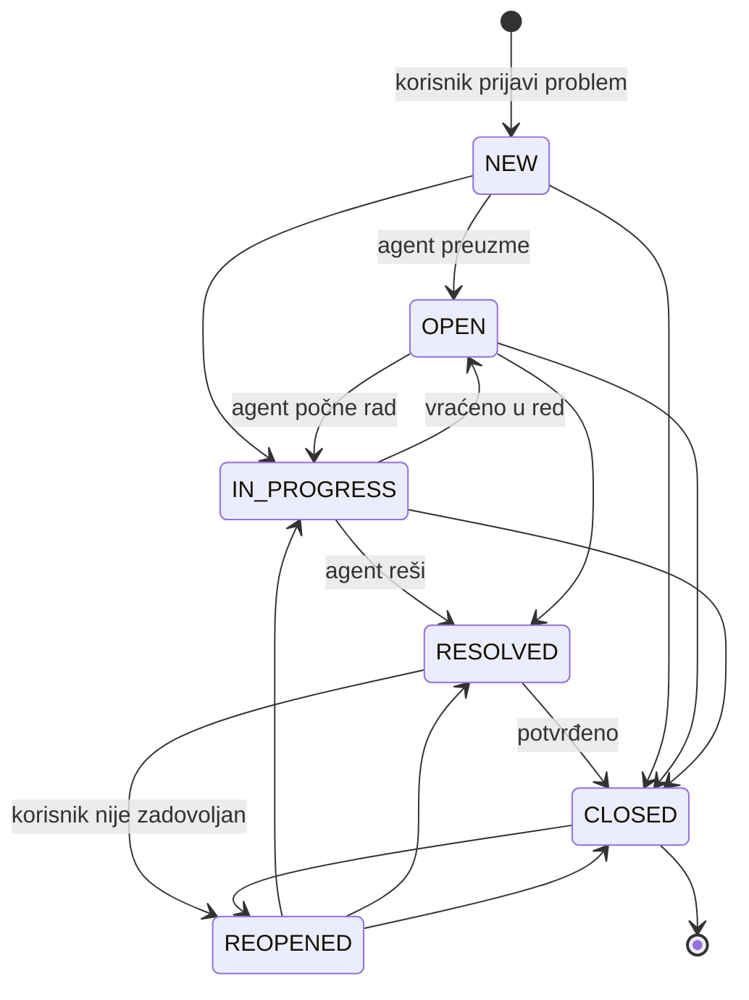
```mermaid
stateDiagram-v2
    [*] --> NEW: korisnik prijavi problem
    NEW --> OPEN: agent preuzme
    NEW --> IN_PROGRESS
    OPEN --> IN_PROGRESS: agent počne rad
    IN_PROGRESS --> RESOLVED: agent reši
    IN_PROGRESS --> OPEN: vraćeno u red
    OPEN --> RESOLVED
    RESOLVED --> CLOSED: potvrđeno
    RESOLVED --> REOPENED: korisnik nije zadovoljan
    CLOSED --> REOPENED
    REOPENED --> IN_PROGRESS
    REOPENED --> RESOLVED
    NEW --> CLOSED
    OPEN --> CLOSED
    IN_PROGRESS --> CLOSED
    REOPENED --> CLOSED
    CLOSED --> [*]
```

## 2.2. Use-case dijagrami

### 2.2.1. Opšti pregled slučajeva korišćenja

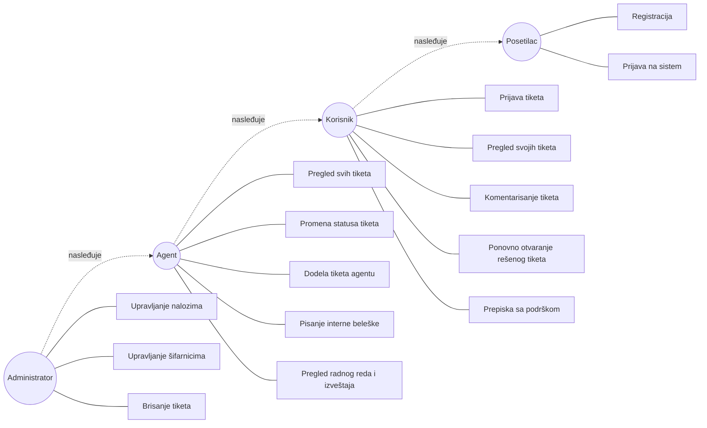
```mermaid
graph LR
    P((Posetilac))
    K((Korisnik))
    A((Agent))
    AD((Administrator))

    P --- UC1[Registracija]
    P --- UC2[Prijava na sistem]

    K --- UC3[Prijava tiketa]
    K --- UC4[Pregled svojih tiketa]
    K --- UC5[Komentarisanje tiketa]
    K --- UC6[Ponovno otvaranje rešenog tiketa]
    K --- UC7[Prepiska sa podrškom]

    A --- UC8[Pregled svih tiketa]
    A --- UC9[Promena statusa tiketa]
    A --- UC10[Dodela tiketa agentu]
    A --- UC11[Pisanje interne beleške]
    A --- UC12[Pregled radnog reda i izveštaja]

    AD --- UC13[Upravljanje nalozima]
    AD --- UC14[Upravljanje šifarnicima]
    AD --- UC15[Brisanje tiketa]

    K -.nasleđuje.-> P
    A -.nasleđuje.-> K
    AD -.nasleđuje.-> A
```

### 2.2.2. Detaljni opis ključnog slučaja korišćenja

**UC-09: Promena statusa tiketa**

| Stavka | Opis |
|---|---|
| **Akter** | Agent (ili administrator) |
| **Cilj** | Pomeriti tiket u sledeće stanje životnog ciklusa |
| **Preduslov** | Akter je prijavljen i ima ulogu `AGENT` ili `ADMIN`; tiket postoji |
| **Osnovni tok** | 1. Agent otvara detalje tiketa.<br>2. Sistem prikazuje traku životnog ciklusa sa trenutnim stanjem i dozvoljenim prelazima.<br>3. Agent bira dozvoljeno stanje.<br>4. Sistem traži napomenu (nije obavezna).<br>5. Sistem menja status, upisuje zapis u istoriju i vraća osvežen tiket. |
| **Alternativni tok A** | Prelaz nije dozvoljen životnim ciklusom → sistem vraća `400` sa spiskom dozvoljenih prelaza. |
| **Alternativni tok B** | Akter ima ulogu `USER` → sistem vraća `403`, a interfejs mu dugmad uopšte i ne prikazuje. |
| **Alternativni tok C** | Tiket prelazi u `CLOSED` → sistem dodatno upisuje vreme zatvaranja. |
| **Rezultat** | Tiket je u novom stanju, a promena je trajno zabeležena sa autorom, vremenom i napomenom. |

**UC-07: Prepiska sa podrškom**

| Stavka | Opis |
|---|---|
| **Akter** | Korisnik i agent |
| **Cilj** | Voditi privatan razgovor koji nije javni komentar na tiketu |
| **Preduslov** | Oba učesnika imaju nalog; korisnik može da piše samo osoblju podrške |
| **Osnovni tok** | 1. Korisnik bira agenta.<br>2. Sistem otvara razgovor ili vraća već postojeći.<br>3. Korisnik šalje poruku.<br>4. Agent u meniju vidi značku sa brojem nepročitanih poruka.<br>5. Otvaranjem razgovora poruke se obeležavaju kao pročitane. |
| **Alternativni tok** | Neko ko nije učesnik pokuša da otvori razgovor → `403`, **uključujući i administratora**. |

## 2.3. Dizajn baze podataka

### 2.3.1. Model podataka

Sistem ima osam JPA entiteta.

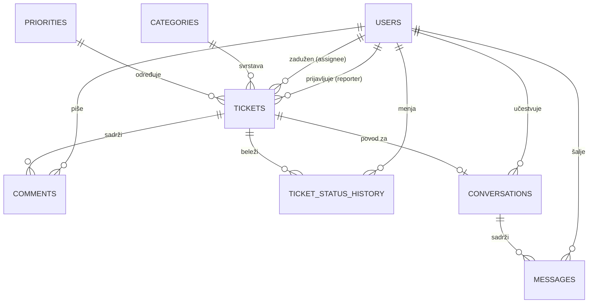
```mermaid
erDiagram
    USERS ||--o{ TICKETS : "prijavljuje (reporter)"
    USERS ||--o{ TICKETS : "zadužen (assignee)"
    USERS ||--o{ COMMENTS : piše
    USERS ||--o{ TICKET_STATUS_HISTORY : menja
    USERS ||--o{ MESSAGES : šalje
    USERS ||--o{ CONVERSATIONS : učestvuje
    CATEGORIES ||--o{ TICKETS : svrstava
    PRIORITIES ||--o{ TICKETS : određuje
    TICKETS ||--o{ COMMENTS : sadrži
    TICKETS ||--o{ TICKET_STATUS_HISTORY : beleži
    TICKETS ||--o| CONVERSATIONS : "povod za"
    CONVERSATIONS ||--o{ MESSAGES : sadrži
```

### 2.3.2. Opis entiteta

| Entitet | Tabela | Ključni atributi |
|---|---|---|
| `User` | `users` | `username` (jedinstven), `email` (jedinstven), `password` (BCrypt heš), `fullName`, `role`, `active` |
| `Category` | `categories` | `name` (jedinstven), `description`, `active` |
| `Priority` | `priorities` | `name`, `level` (1–10), `slaHours` (rok odziva u satima) |
| `Ticket` | `tickets` | `title`, `description`, `status`, `createdAt`, `updatedAt`, `closedAt` |
| `Comment` | `comments` | `content`, `internal`, `createdAt` |
| `TicketStatusHistory` | `ticket_status_history` | `oldStatus`, `newStatus`, `note`, `changedAt` |
| `Conversation` | `conversations` | `participantOne`, `participantTwo`, opcioni `ticket`, `createdAt` |
| `Message` | `messages` | `content`, `sentAt`, `readAt` |

### 2.3.3. Relacije između entiteta

Entitet `Ticket` je čvorište modela i najbolje pokazuje sve tipove relacija:

```java
@Entity
@Table(name = "tickets")
public class Ticket {

    @Id
    @GeneratedValue(strategy = GenerationType.IDENTITY)
    private Long id;

    @Enumerated(EnumType.STRING)
    @Column(nullable = false, length = 20)
    private TicketStatus status = TicketStatus.NEW;

    /** Korisnik koji je prijavio problem. */
    @ManyToOne(fetch = FetchType.LAZY, optional = false)
    @JoinColumn(name = "reporter_id", nullable = false)
    private User reporter;

    /** Agent koji je preuzeo tiket; null dok tiket nije dodeljen. */
    @ManyToOne(fetch = FetchType.LAZY)
    @JoinColumn(name = "assignee_id")
    private User assignee;

    @ManyToOne(fetch = FetchType.LAZY, optional = false)
    @JoinColumn(name = "category_id", nullable = false)
    private Category category;

    @ManyToOne(fetch = FetchType.LAZY, optional = false)
    @JoinColumn(name = "priority_id", nullable = false)
    private Priority priority;

    /* Komentari i istorija postoje samo uz tiket i brisu se zajedno sa njim. */
    @OneToMany(mappedBy = "ticket", cascade = CascadeType.ALL, orphanRemoval = true)
    @OrderBy("createdAt ASC")
    private List<Comment> comments = new ArrayList<>();

    @OneToMany(mappedBy = "ticket", cascade = CascadeType.ALL, orphanRemoval = true)
    @OrderBy("changedAt ASC")
    private List<TicketStatusHistory> history = new ArrayList<>();
}
```

**Objašnjenja projektnih odluka**

- **`FetchType.LAZY` na svim `@ManyToOne` relacijama.** Podrazumevano ponašanje JPA za
  `@ManyToOne` je `EAGER`, što znači da bi učitavanje jednog tiketa povuklo i prijavioca, i
  agenta, i kategoriju, i prioritet — čak i kada od svega toga treba samo naslov. Kod liste
  od stotinu tiketa to je stotine nepotrebnih upita.
- **`cascade = ALL` i `orphanRemoval` samo na `comments` i `history`.** Komentar bez tiketa
  nema smisla i mora nestati sa njim. Kod veze `Ticket → Conversation` je obrnuto: razgovor
  pripada sagovornicima, a ne tiketu, pa se pri brisanju tiketa veza samo raskida.
- **`@Enumerated(EnumType.STRING)`.** Da se u bazi upisuje `IN_PROGRESS`, a ne redni broj —
  redni brojevi bi se pomerili prvim ubacivanjem nove vrednosti u enum.

### 2.3.4. Izvedeni podaci

Rok odziva se **ne čuva u bazi** nego se računa iz prioriteta, pa promena SLA pravila na
šifarniku odmah važi za sve postojeće tikete:

```java
/** Rok odziva: vreme prijave uvećano za broj sati koji nosi prioritet. */
public LocalDateTime getSlaDeadline() {
    return createdAt == null ? null : createdAt.plusHours(priority.getSlaHours());
}
```

Da li je rok probijen računa se pri pravljenju odgovora, jer zavisi od trenutnog vremena i
nema smisla čuvati ga kao kolonu koja bi odmah zastarela:

```java
public static TicketSummaryResponse from(Ticket ticket) {
    LocalDateTime deadline = ticket.getSlaDeadline();
    boolean breached = deadline != null
            && !ticket.getStatus().isTerminal()
            && LocalDateTime.now().isAfter(deadline);
    ...
}
```

Zatvoren tiket se nikada ne prijavljuje kao probijen — rok meri odziv, a ne prošlost.

### 2.3.5. Sprečavanje duplih razgovora

Razgovor je definisan parom učesnika. Da isti par ne bi mogao da napravi dva razgovora,
učesnici se pri upisu **normalizuju** — manji `id` uvek ide u `participantOne` — pa
jedinstveni ključ nad parom kolona radi bez obzira na to ko je prvi započeo prepisku:

```java
@Table(name = "conversations",
       uniqueConstraints = @UniqueConstraint(
               name = "uk_conversation_participants",
               columnNames = {"participant_one_id", "participant_two_id"}))
```

---

# 3. Razvoj korisničkog interfejsa (UI)

Frontend je jednostranična React aplikacija napravljena alatom Vite. Komunicira isključivo
sa REST API-jem, a u razvoju Vite preusmerava sve zahteve sa `/api` na Spring Boot na portu
8080, pa pregledač frontend i API vidi kao isto poreklo.

**Vizuelni pristup.** Stilovi su pisani ručno, bez CSS okvira, na osnovu skupa promenljivih
definisanih na jednom mestu. Boja se namerno štedi: jedine zasićene površine na ekranu su
oznake statusa tiketa. Razlog je praktičan — agent po boji čita stanje tiketa pre nego što
pročita naslov, pa boja mora da nosi informaciju, a ne da ukrašava.

## 3.1. Pregled ključnih stranica

### 3.1.1. Prijava na sistem

Jedini ekran koji se vidi bez naloga. Levo su objašnjeni put koji tiket prelazi i prava
svake od tri uloge, desno je obrazac. Nalozi za probu su prikazani namerno, da se sistem
može pregledati kroz sve tri uloge bez traženja lozinki po dokumentaciji.

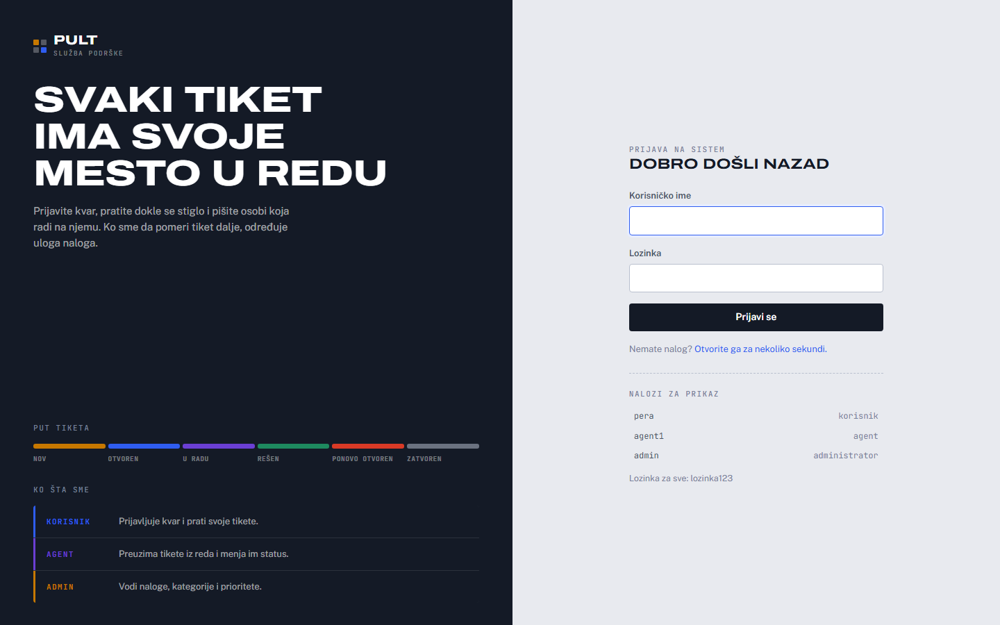

### 3.1.2. Registracija

Javna registracija ne šalje ulogu. Da je šalje, bilo bi dovoljno izmeniti zahtev u
pregledaču i napraviti sebi administratorski nalog — server zato svakom novom nalogu sam
dodeljuje ulogu `USER`.

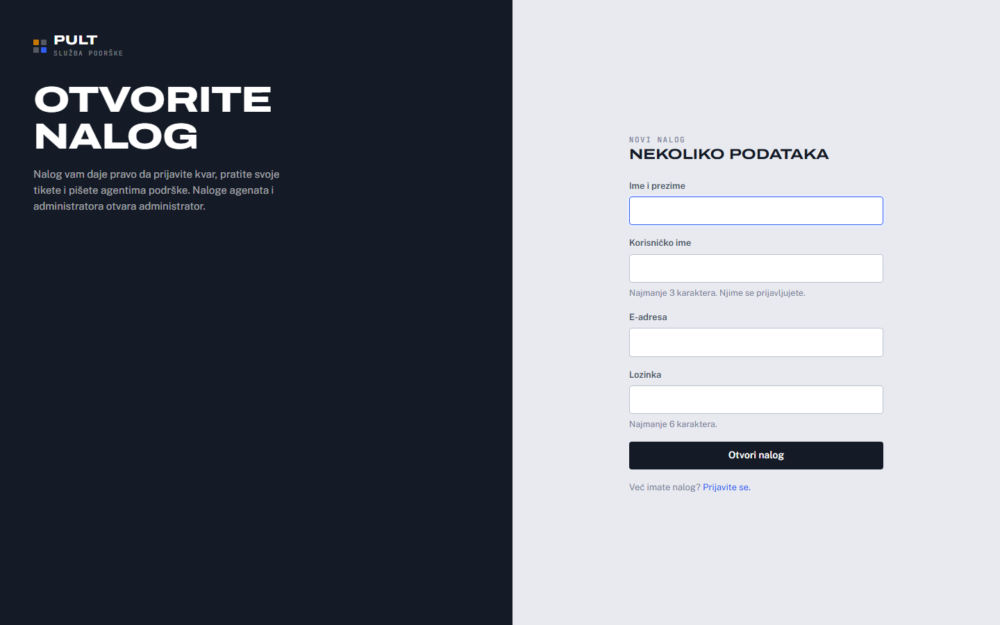

### 3.1.3. Početna strana (pregled)

Početna strana nije ista za sve. Agent i administrator dobijaju stanje cele službe:
pokazatelje, raspodelu po statusima i kategorijama i poslednje prijavljene tikete.

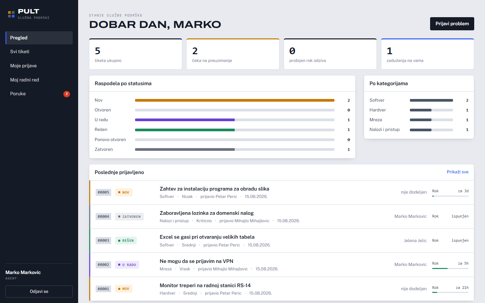

Korisnik na istoj ruti vidi samo svoje tikete — brojevi tuđih tiketa mu ništa ne znače, a
API za izveštaje mu je i zatvoren.

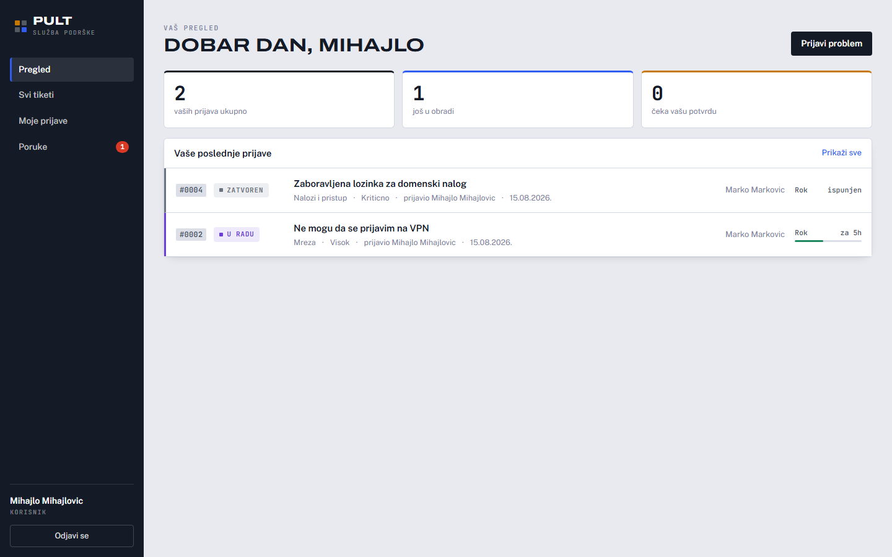

### 3.1.4. Lista tiketa

Tiketi su prikazani kao redovi, a ne kao kartice: spisak koji se gleda ceo dan mora da se
čita u jednom pogledu. Leva ivica svakog reda nosi boju statusa, a desna strana meri
preostali rok odziva. Podržani su filteri po statusu, kategoriji, prioritetu i pojmu, kao i
straničenje.

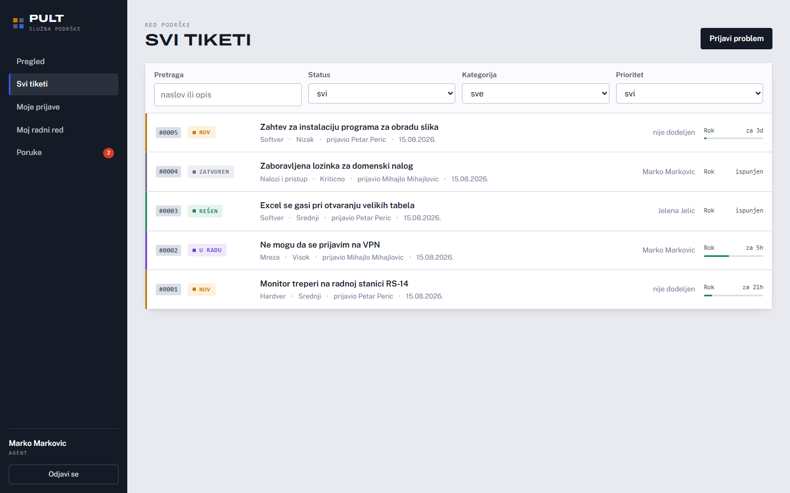

Agent ima i poseban ekran sa tiketima koji su dodeljeni njemu:

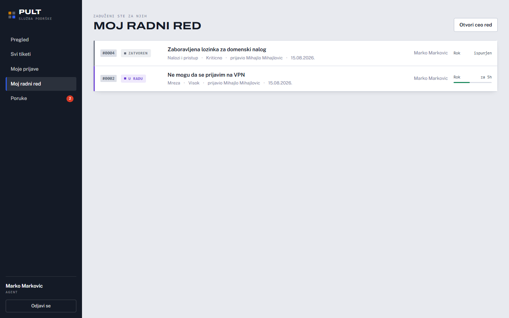

### 3.1.5. Detalji tiketa — pogled agenta

Ovo je centralni ekran aplikacije. Preko cele širine, iznad ostalog sadržaja, stoji **traka
životnog ciklusa**: popunjena šina je stanje u kome je tiket sada, isprekidana je stanje u
koje se sme preći i njeno dugme radi, a prazna šina znači da prelaz nije dozvoljen.

Skup dozvoljenih prelaza se ne računa u pregledaču nego stiže uz tiket (`allowedTransitions`),
pa je ono što korisnik vidi uvek isto ono što će server i dozvoliti.

Agent ovde vidi **tri komentara**, među kojima je i interna beleška, jasno izdvojena bojom.

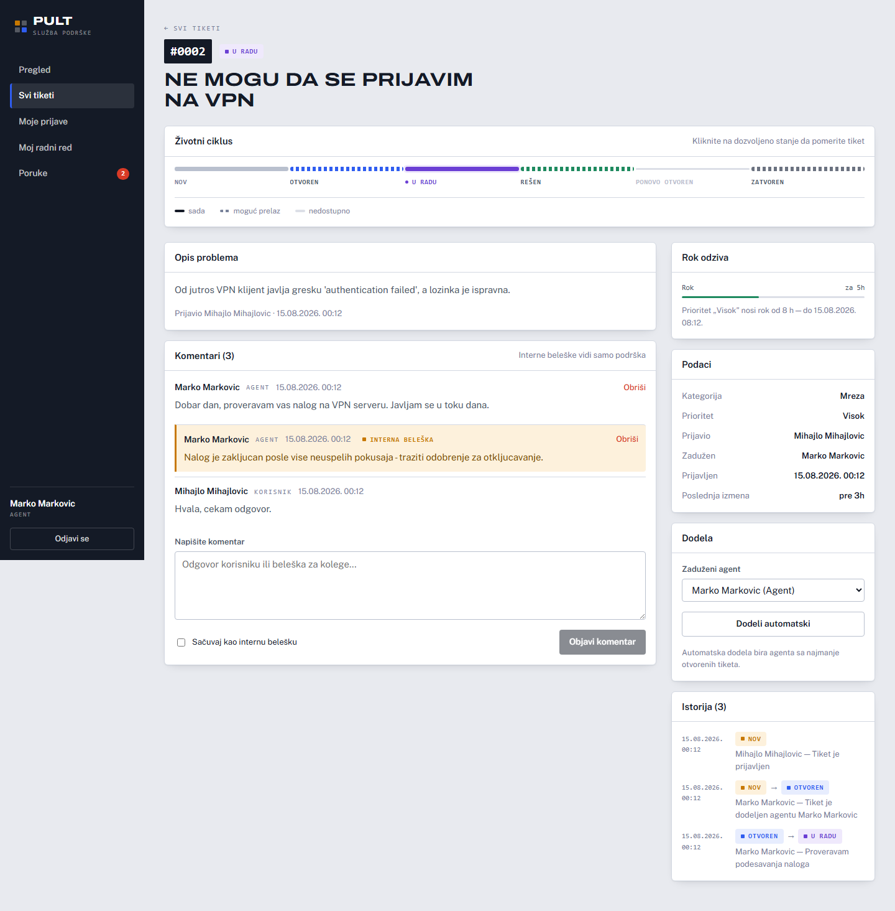

### 3.1.6. Detalji tiketa — pogled korisnika

Isti tiket, isti URL, drugi nalog. Razlike su:

- **Komentara je dva, a ne tri** — interna beleška nije stigla do pregledača,
- **traka životnog ciklusa nema nijedno aktivno dugme**, uz napomenu da status menja
  isključivo podrška,
- nema panela za dodelu agenta,
- pojavljuje se dugme za slanje poruke zaduženom agentu.

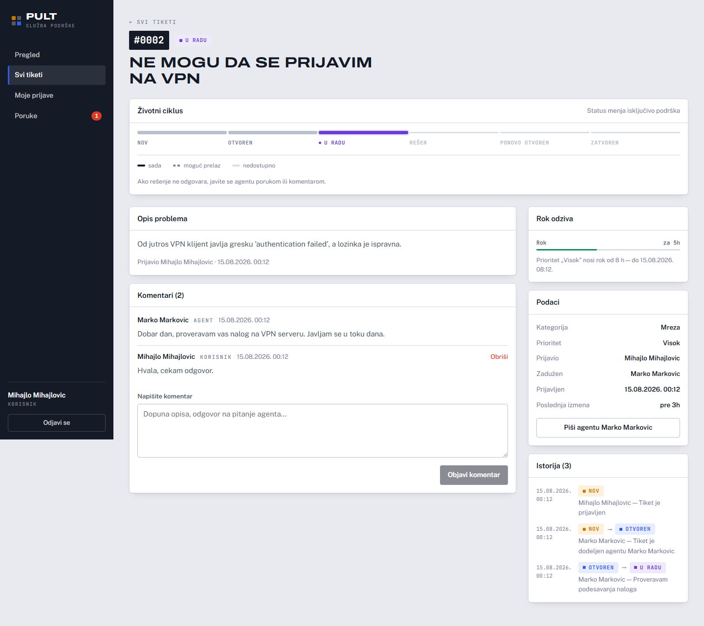

Ovaj par slika je najkraći dokaz da RBAC radi na nivou zapisa, a ne samo na nivou rute.

### 3.1.7. Prijava novog tiketa

Prijavilac se ne bira u obrascu — server ga uzima iz tokena, pa nije moguće prijaviti tiket
u tuđe ime. Izborom prioriteta odmah se prikazuje rok odziva koji taj prioritet nosi.

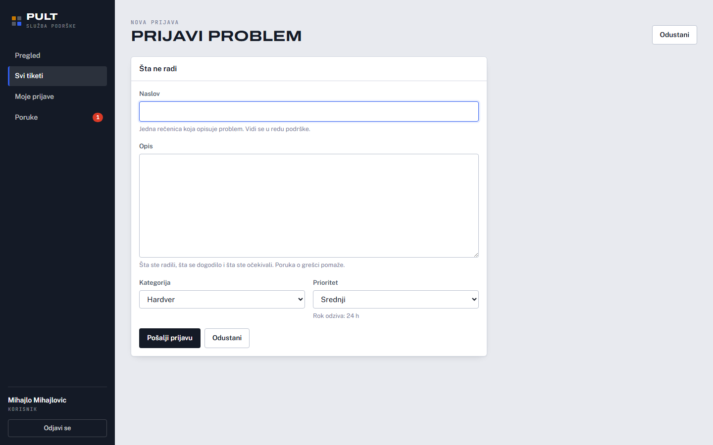

### 3.1.8. Moje prijave

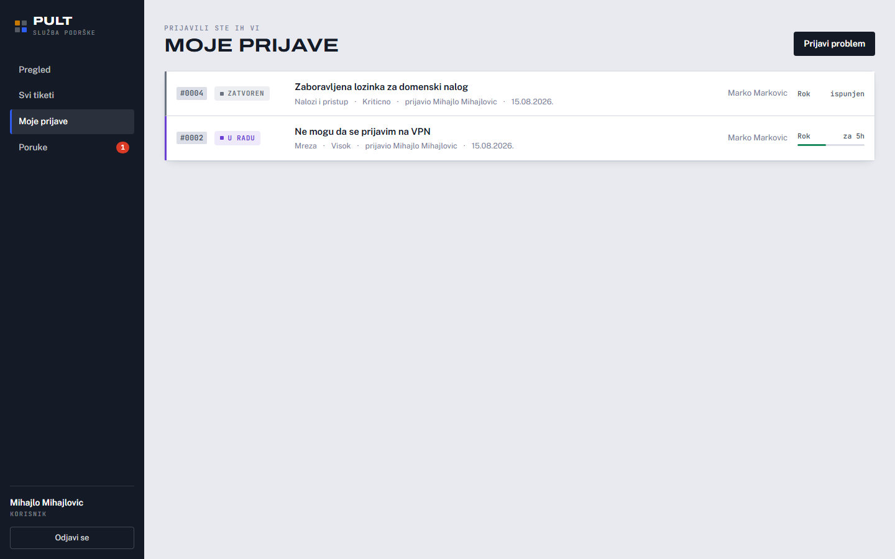

### 3.1.9. Prepiska (chat)

Privatni razgovori između korisnika i podrške. Levo je spisak razgovora sa najavom poslednje
poruke i brojem nepročitanih, desno je tok poruka. Otvaranje razgovora usput obeležava tuđe
poruke kao pročitane. Razgovor može biti vezan za tiket povodom koga je započet.

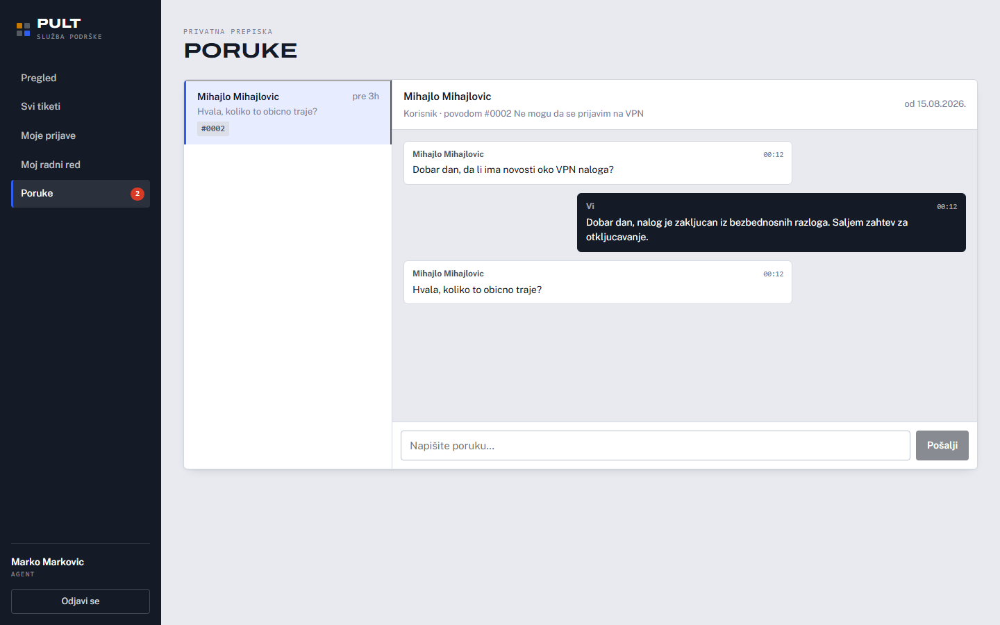

### 3.1.10. Administrativni panel — nalozi

Ovde nastaju nalozi agenata, što kroz javnu registraciju nije moguće. Nalozi se ne brišu
nego deaktiviraju, da tiketi, komentari i poruke koje je taj nalog ostavio ne ostanu bez
autora. Administrator sebi ne može da promeni ulogu niti da deaktivira sopstveni nalog, pa
su te kontrole u tabeli i onemogućene.

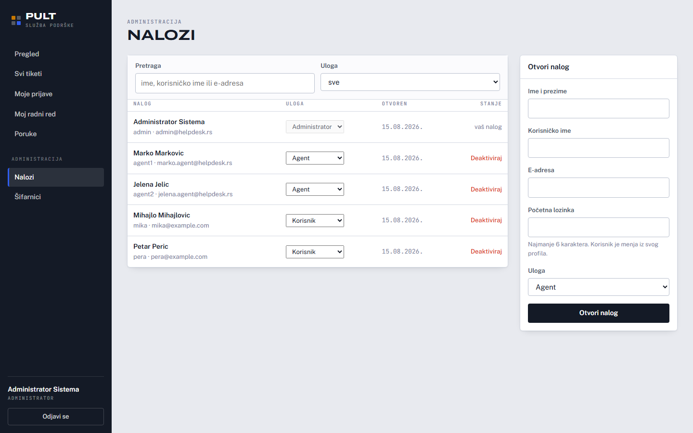

### 3.1.11. Administrativni panel — šifarnici

Kategorija koja je već upotrebljena na tiketima se ne briše nego povlači iz upotrebe i može
se vratiti.

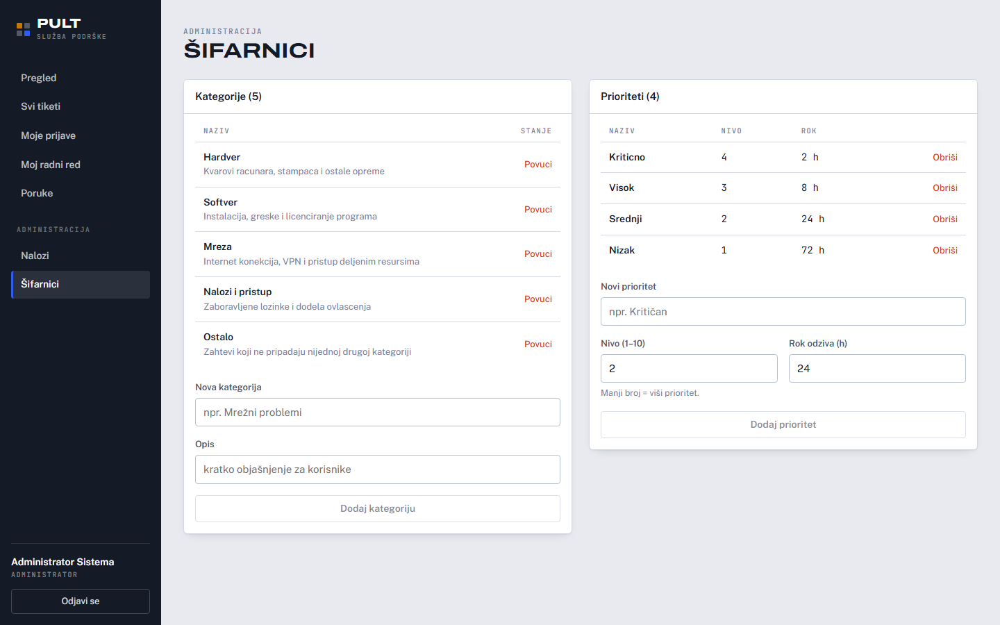

### 3.1.12. Pokušaj pristupa zabranjenoj strani

Kada korisnik ručno upiše administrativnu adresu, dobija jasno obaveštenje. Ovo je samo
udobnost — i da ekran nekako otvori, API bi na svaki zahtev odgovorio sa `403`.

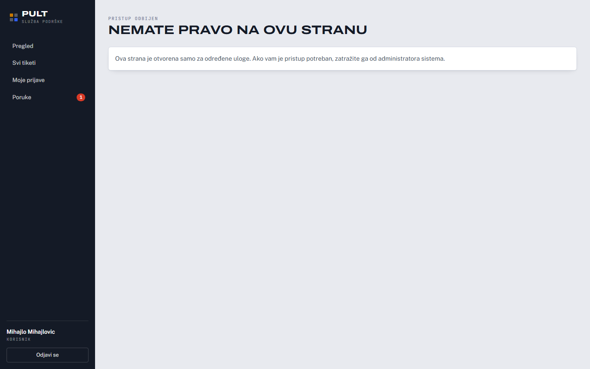

### 3.1.13. Mobilni prikaz

Raspored je prilagodljiv: navigaciona traka se na uskim ekranima prebacuje u zaglavlje, a
redovi tiketa se preslažu u više redova.

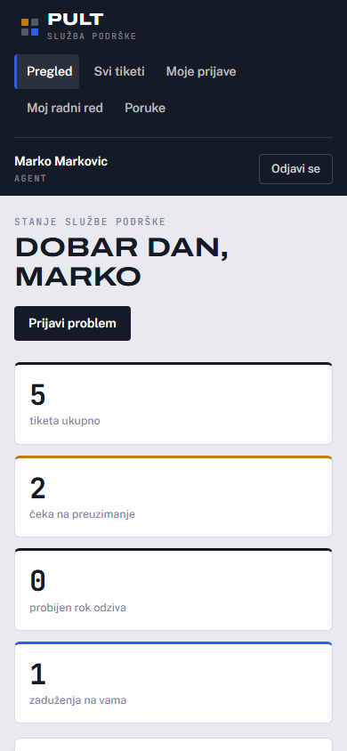

---

# 4. Backend implementacija

## 4.1. Arhitektura aplikacije

Aplikacija je organizovana u klasičnu slojevitu arhitekturu, gde svaki sloj razgovara samo
sa slojem ispod sebe:

```
        HTTP zahtev
             │
             ▼
   ┌─────────────────────┐
   │  Security filteri   │  JwtAuthenticationFilter popunjava SecurityContext
   └─────────────────────┘
             │
             ▼
   ┌─────────────────────┐
   │  Controller sloj    │  @RestController - prima zahtev, vraća DTO
   │                     │  ovde: validacija ulaza i zaštita po ulozi
   └─────────────────────┘
             │  DTO
             ▼
   ┌─────────────────────┐
   │  Service sloj       │  poslovna logika, @Transactional granice
   │                     │  ovde: pravila pristupa nad konkretnim zapisom
   └─────────────────────┘
             │  entiteti
             ▼
   ┌─────────────────────┐
   │  Repository sloj    │  Spring Data JPA interfejsi
   └─────────────────────┘
             │
             ▼
        H2 baza podataka
```

**Struktura paketa** (`rs.ac.metropolitan.it355.helpdesk`):

| Paket | Sadržaj |
|---|---|
| `model` | JPA entiteti i enumeracije (`Role`, `TicketStatus`) |
| `repository` | Spring Data JPA repozitorijumi |
| `service` | Poslovna logika i pravila pristupa nad zapisima |
| `controller` | REST kontroleri |
| `dto` | Zapisi (Java `record`) za ulaz i izlaz |
| `security` | JWT servis, filter, `UserPrincipal`, rukovaoci greškama 401/403 |
| `config` | `SecurityConfig`, `OpenApiConfig`, punjenje početnih podataka |
| `exception` | Sopstveni izuzeci i globalna obrada grešaka |

**Zašto DTO umesto entiteta.** Entiteti se nikada ne šalju direktno u odgovoru. Da se šalju,
`User` bi u odgovoru nosio i heš lozinke, a lenja učitavanja bi pri serijalizaciji pucala
izvan transakcije. DTO-ovi su implementirani kao Java `record` tipovi, sa statičkom `from`
metodom koja radi preslikavanje.

## 4.2. Sloj perzistencije (Spring Data JPA)

### 4.2.1. Ključni entitet — `Ticket`

Prikazan je u odeljku [2.3.3](#233-relacije-između-entiteta).

### 4.2.2. Poslovno pravilo unutar enumeracije

Pravila životnog ciklusa žive u samoj enumeraciji, a ne u servisu. Time je nemoguće da se
pravilo raziđe između modela i poslovne logike:

```java
public enum TicketStatus {

    NEW, OPEN, IN_PROGRESS, RESOLVED, CLOSED, REOPENED;

    public Set<TicketStatus> allowedTransitions() {
        return switch (this) {
            case NEW         -> Set.of(OPEN, IN_PROGRESS, CLOSED);
            case OPEN        -> Set.of(IN_PROGRESS, RESOLVED, CLOSED);
            case IN_PROGRESS -> Set.of(RESOLVED, OPEN, CLOSED);
            case RESOLVED    -> Set.of(CLOSED, REOPENED);
            case REOPENED    -> Set.of(IN_PROGRESS, RESOLVED, CLOSED);
            case CLOSED      -> Set.of(REOPENED);
        };
    }

    public boolean canTransitionTo(TicketStatus target) {
        return allowedTransitions().contains(target);
    }

    public boolean isTerminal() {
        return this == CLOSED;
    }
}
```

Isti taj skup se šalje frontendu u polju `allowedTransitions`, pa traka životnog ciklusa u
interfejsu ne pogađa ništa.

### 4.2.3. Repozitorijumi

Repozitorijumi su interfejsi koji nasleđuju `JpaRepository`; Spring Data im generiše
implementaciju.

**Izvedene metode iz naziva** — bez ijedne linije koda:

```java
@Repository
public interface UserRepository extends JpaRepository<User, Long> {

    /** Koristi ga UserDetailsService prilikom prijave. */
    Optional<User> findByUsername(String username);

    Optional<User> findByEmail(String email);

    boolean existsByUsername(String username);

    boolean existsByEmail(String email);

    List<User> findByRole(Role role);

    Page<User> findByRole(Role role, Pageable pageable);
}
```

```java
public interface CommentRepository extends JpaRepository<Comment, Long> {

    List<Comment> findByTicketIdOrderByCreatedAtAsc(Long ticketId);

    /* Ista lista, bez internih beleški - koristi se kada tiket otvara korisnik. */
    List<Comment> findByTicketIdAndInternalFalseOrderByCreatedAtAsc(Long ticketId);
}
```

**Prilagođeni upiti sa `@Query`.** Pretraga tiketa rešena je jednim upitom sa opcionim
filterima: kada je parametar `null`, odgovarajući uslov se preskače. Alternativa bi bila
osam kombinacija metoda ili `Specification` API, što je za ovaj broj filtera nepotrebno:

```java
@Query("""
        SELECT t FROM Ticket t
        WHERE (:status     IS NULL OR t.status = :status)
          AND (:categoryId IS NULL OR t.category.id = :categoryId)
          AND (:priorityId IS NULL OR t.priority.id = :priorityId)
          AND (:assigneeId IS NULL OR t.assignee.id = :assigneeId)
          AND (:reporterId IS NULL OR t.reporter.id = :reporterId)
          AND (:term IS NULL OR LOWER(t.title) LIKE LOWER(CONCAT('%', :term, '%'))
                             OR LOWER(t.description) LIKE LOWER(CONCAT('%', :term, '%')))
        """)
Page<Ticket> search(@Param("status") TicketStatus status,
                    @Param("categoryId") Long categoryId,
                    @Param("priorityId") Long priorityId,
                    @Param("assigneeId") Long assigneeId,
                    @Param("reporterId") Long reporterId,
                    @Param("term") String term,
                    Pageable pageable);
```

**Rešavanje problema N+1 pomoću `JOIN FETCH`.** Prikaz prepiske traži ime pošiljaoca svake
poruke. Bez `JOIN FETCH`-a, razgovor sa dvadeset poruka pokrenuo bi dvadeset dodatnih upita:

```java
@Query("""
        SELECT m FROM Message m
        JOIN FETCH m.sender
        WHERE m.conversation.id = :conversationId
        ORDER BY m.sentAt ASC
        """)
List<Message> findByConversationWithSender(@Param("conversationId") Long conversationId);
```

**Grupno ažuriranje pomoću `@Modifying`.** Otvaranje razgovora obeležava sve tuđe
nepročitane poruke odjednom, umesto da ih učitava i pamti jednu po jednu:

```java
@Modifying(clearAutomatically = true, flushAutomatically = true)
@Query("""
        UPDATE Message m SET m.readAt = :readAt
        WHERE m.conversation.id = :conversationId
          AND m.sender.id <> :userId
          AND m.readAt IS NULL
        """)
int markConversationAsRead(@Param("conversationId") Long conversationId,
                           @Param("userId") Long userId,
                           @Param("readAt") LocalDateTime readAt);
```

> **Napomena o `clearAutomatically = true`:** ovaj parametar čisti kontekst perzistencije
> posle izmene, da bi naredna čitanja videla nove vrednosti. Posledica je da se ranije
> učitani entiteti odvajaju od konteksta, pa se razgovor mora ponovo učitati upitom koji
> učesnike odmah dovlači (`findByIdWithParticipants`). Ovo je bila stvarna greška otkrivena
> tokom razvoja i opisana je u zaključku.

## 4.3. Servisni sloj

Servisni sloj nosi poslovnu logiku i, što je za ovu temu najvažnije, **pravila pristupa nad
konkretnim zapisom** — ona na koja se ne može odgovoriti gledajući samo URL i ulogu.

### 4.3.1. Upotreba `@Transactional`

| Upotreba | Značenje |
|---|---|
| `@Transactional(readOnly = true)` | Metode koje samo čitaju. Hibernate preskače proveru izmena na kraju transakcije, a JDBC drajver zna da je upit samo za čitanje. |
| `@Transactional` | Metode koje menjaju podatke. Sve izmene unutar metode uspevaju zajedno ili se zajedno poništavaju. |

Transakcija se otvara na servisu, a ne na kontroleru, jer je servis granica jedne poslovne
operacije. Zbog toga je u `application.yml` isključen `open-in-view`: kada bi bio uključen,
transakcija bi ostajala otvorena sve do slanja odgovora i lenja učitavanja bi tiho radila
i izvan servisa, što skriva probleme sa N+1 upitima.

### 4.3.2. Ključna metoda — promena statusa

```java
/**
 * Promena statusa tiketa - operacija rezervisana za agente i administratore.
 *
 * Dozvoljeni prelazi se ne proveravaju ovde, već ih zna sam TicketStatus,
 * pa je nemoguće da se pravilo raziđe između servisa i modela.
 */
@Transactional
public TicketResponse changeStatus(Long id, ChangeStatusRequest request, UserPrincipal principal) {
    Ticket ticket = findTicketOrThrow(id);
    User actor = userService.findEntityById(principal.getId());

    TicketStatus current = ticket.getStatus();
    TicketStatus target = request.status();

    if (current == target) {
        throw new BusinessRuleException("Tiket je vec u statusu " + target);
    }
    if (!current.canTransitionTo(target)) {
        throw new BusinessRuleException(
                "Prelaz iz statusa " + current + " u " + target + " nije dozvoljen. Dozvoljeni prelazi: "
                        + current.allowedTransitions());
    }

    applyStatusChange(ticket, actor, target, request.note());
    return buildFullResponse(ticket, principal);
}
```

Metoda `applyStatusChange` menja status, upisuje zapis u istoriju i, ako je novo stanje
`CLOSED`, beleži vreme zatvaranja. Sve to je u jednoj transakciji, pa je nemoguće da tiket
promeni status a da promena ne uđe u istoriju.

### 4.3.3. Pravila pristupa nad zapisom

```java
/**
 * Osoblje podrške vidi sve tikete, a korisnik samo one koje je sam prijavio.
 *
 * Baca se 403 umesto 404 svesno: korisnik koji pogodi tuđi id ne treba da
 * dobije potvrdu da taj tiket postoji, ali odgovor mora da bude isti bez obzira
 * na to da li tiket postoji ili ne - zato provera dolazi tek posle učitavanja.
 */
void assertCanView(Ticket ticket, UserPrincipal principal) {
    if (principal.isStaff() || isReporter(ticket, principal)) {
        return;
    }
    throw new AccessDeniedException("Nemate pristup ovom tiketu");
}
```

### 4.3.4. Filter koji korisnik ne može da zaobiđe

Pri pretrazi tiketa korisniku se filter po prijaviocu postavlja **na serveru**, bez obzira
na to šta je poslao u parametrima zahteva:

```java
@Transactional(readOnly = true)
public PageResponse<TicketSummaryResponse> search(TicketStatus status, Long categoryId,
                                                  Long priorityId, Long assigneeId,
                                                  String term, Pageable pageable,
                                                  UserPrincipal principal) {

    // Ključni red: korisnik uvek dobija samo svoje tikete.
    Long reporterFilter = principal.isStaff() ? null : principal.getId();
    String searchTerm = (term == null || term.isBlank()) ? null : term.trim();

    Page<Ticket> page = ticketRepository.search(
            status, categoryId, priorityId, assigneeId, reporterFilter, searchTerm, pageable);

    return PageResponse.of(page, TicketSummaryResponse::from);
}
```

### 4.3.5. Interne beleške se ne filtriraju — one se ne učitavaju

Razlika je suštinska: podatak koji korisnik ne sme da vidi nikada ne napušta bazu.

```java
List<Comment> comments = principal.isStaff()
        ? commentRepository.findByTicketIdOrderByCreatedAtAsc(id)
        : commentRepository.findByTicketIdAndInternalFalseOrderByCreatedAtAsc(id);
```

### 4.3.6. Privatnost prepiske — pravilo jače od uloge

Jedino mesto u sistemu gde administrator **nema** prednost:

```java
private void assertParticipant(Conversation conversation, UserPrincipal principal) {
    if (!conversation.hasParticipant(principal.getId())) {
        throw new AccessDeniedException("Nemate pristup ovoj prepisci");
    }
}

private void assertMayContact(User sender, User recipient) {
    if (!sender.isStaff() && !recipient.isStaff()) {
        throw new AccessDeniedException("Poruke mozete slati samo agentima podrske");
    }
}
```

### 4.3.7. Automatska dodela agenta

Kada agent nije naveden, tiket dobija agent sa najmanje otvorenih tiketa. `LEFT JOIN` je
ovde bitan: bez njega agent koji nema nijedan tiket ne bi ušao u rezultat, a upravo on
treba prvi da dobije novi tiket.

```java
/**
 * Agent sa najmanje otvorenih tiketa - koristi se za automatsku dodelu tiketa.
 * Vraca listu sortiranu rastuce po broju aktivnih tiketa, pa se uzima prvi element.
 */
@Query("""
        SELECT u FROM User u
        LEFT JOIN Ticket t ON t.assignee = u AND t.status <> rs.ac.metropolitan.it355.helpdesk.model.TicketStatus.CLOSED
        WHERE u.role = rs.ac.metropolitan.it355.helpdesk.model.Role.AGENT AND u.active = true
        GROUP BY u
        ORDER BY COUNT(t) ASC
        """)
List<User> findAgentsOrderedByWorkload(Pageable pageable);
```

## 4.4. REST API sloj

### 4.4.1. Opis kontrolera

| Kontroler | Osnovna putanja | Svrha |
|---|---|---|
| `AuthController` | `/api/auth` | Registracija, prijava, podaci o prijavljenom nalogu |
| `TicketController` | `/api/tickets` | Ceo životni vek tiketa |
| `CommentController` | `/api` | Komentari i interne beleške |
| `ConversationController` | `/api/conversations` | Privatna prepiska |
| `CategoryController` | `/api/categories` | Šifarnik kategorija |
| `PriorityController` | `/api/priorities` | Šifarnik prioriteta |
| `AdminUserController` | `/api/admin/users` | Administracija naloga |
| `UserController` | `/api/users` | Spisak agenata, izmena lozinke |
| `ReportController` | `/api/reports` | Izveštaj o stanju službe |

### 4.4.2. Spisak svih endpointa

Ukupno **39 endpointa**. Kolona „Pristup" navodi minimalno potrebnu ulogu.

**Autentifikacija**

| # | Metoda | Putanja | Svrha | Pristup |
|---|---|---|---|---|
| 1 | `POST` | `/api/auth/register` | Registracija; vraća JWT | javno |
| 2 | `POST` | `/api/auth/login` | Prijava; vraća JWT | javno |
| 3 | `GET` | `/api/auth/me` | Podaci o prijavljenom nalogu | prijavljen |

**Tiketi**

| # | Metoda | Putanja | Svrha | Pristup |
|---|---|---|---|---|
| 4 | `GET` | `/api/tickets` | Pretraga sa filterima i straničenjem | prijavljen¹ |
| 5 | `GET` | `/api/tickets/my` | Sopstvene prijave | prijavljen |
| 6 | `GET` | `/api/tickets/assigned-to-me` | Radni red agenta | AGENT, ADMIN |
| 7 | `GET` | `/api/tickets/{id}` | Detalji tiketa | prijavljen² |
| 8 | `POST` | `/api/tickets` | Prijava novog tiketa | prijavljen |
| 9 | `PUT` | `/api/tickets/{id}` | Izmena tiketa | prijavljen³ |
| 10 | `PATCH` | `/api/tickets/{id}/status` | **Promena statusa** | AGENT, ADMIN |
| 11 | `PATCH` | `/api/tickets/{id}/assign` | Dodela agentu | AGENT, ADMIN |
| 12 | `PATCH` | `/api/tickets/{id}/reopen` | Ponovno otvaranje | prijavilac ili osoblje |
| 13 | `DELETE` | `/api/tickets/{id}` | Brisanje tiketa | ADMIN |

¹ Korisniku se filter po prijaviocu postavlja na serveru.
² Korisnik samo sopstveni tiket, inače `403`.
³ Prijavilac samo dok je tiket `NEW` i bez izmene prioriteta.

**Komentari**

| # | Metoda | Putanja | Svrha | Pristup |
|---|---|---|---|---|
| 14 | `GET` | `/api/tickets/{ticketId}/comments` | Komentari tiketa | prijavljen⁴ |
| 15 | `POST` | `/api/tickets/{ticketId}/comments` | Dodavanje komentara | prijavljen⁵ |
| 16 | `DELETE` | `/api/comments/{commentId}` | Brisanje komentara | autor ili ADMIN |

⁴ Korisnik ne dobija interne beleške.
⁵ Zahtev za internom beleškom od korisnika se odbija sa `403`.

**Prepiska**

| # | Metoda | Putanja | Svrha | Pristup |
|---|---|---|---|---|
| 17 | `GET` | `/api/conversations` | Sopstveni razgovori | učesnik |
| 18 | `GET` | `/api/conversations/unread-count` | Broj nepročitanih poruka | prijavljen |
| 19 | `GET` | `/api/conversations/{id}` | Otvaranje razgovora | **samo učesnik** |
| 20 | `POST` | `/api/conversations` | Započinjanje razgovora | prijavljen⁶ |
| 21 | `POST` | `/api/conversations/{id}/messages` | Slanje poruke | samo učesnik |

⁶ Korisnik može da piše samo osoblju podrške.

**Šifarnici**

| # | Metoda | Putanja | Svrha | Pristup |
|---|---|---|---|---|
| 22 | `GET` | `/api/categories` | Lista kategorija | javno |
| 23 | `GET` | `/api/categories/{id}` | Jedna kategorija | javno |
| 24 | `POST` | `/api/categories` | Nova kategorija | ADMIN |
| 25 | `PUT` | `/api/categories/{id}` | Izmena kategorije | ADMIN |
| 26 | `DELETE` | `/api/categories/{id}` | Brisanje / povlačenje | ADMIN |
| 27 | `GET` | `/api/priorities` | Lista prioriteta | javno |
| 28 | `GET` | `/api/priorities/{id}` | Jedan prioritet | javno |
| 29 | `POST` | `/api/priorities` | Novi prioritet | ADMIN |
| 30 | `PUT` | `/api/priorities/{id}` | Izmena prioriteta | ADMIN |
| 31 | `DELETE` | `/api/priorities/{id}` | Brisanje prioriteta | ADMIN |

**Administracija i nalozi**

| # | Metoda | Putanja | Svrha | Pristup |
|---|---|---|---|---|
| 32 | `GET` | `/api/admin/users` | Lista naloga | ADMIN |
| 33 | `GET` | `/api/admin/users/{id}` | Jedan nalog | ADMIN |
| 34 | `POST` | `/api/admin/users` | Otvaranje naloga sa ulogom | ADMIN |
| 35 | `PUT` | `/api/admin/users/{id}` | Izmena naloga | ADMIN |
| 36 | `DELETE` | `/api/admin/users/{id}` | Deaktivacija naloga | ADMIN |
| 37 | `GET` | `/api/users/agents` | Spisak agenata | prijavljen |
| 38 | `POST` | `/api/users/me/change-password` | Izmena sopstvene lozinke | prijavljen |
| 39 | `GET` | `/api/reports/dashboard` | Izveštaj o stanju službe | AGENT, ADMIN |

### 4.4.3. Primer koda kontrolera

```java
@PatchMapping("/{id}/status")
@PreAuthorize("hasAnyRole('AGENT', 'ADMIN')")
@Operation(summary = "Promena statusa tiketa",
        description = """
                Ključna RBAC operacija: status menja isključivo osoblje podrške.
                Dozvoljeni su samo prelazi koje propisuje životni ciklus tiketa,
                a svaka promena ostavlja trag u istoriji.
                """)
@ApiResponses({
        @ApiResponse(responseCode = "200", description = "Status je promenjen"),
        @ApiResponse(responseCode = "400", description = "Prelaz između statusa nije dozvoljen"),
        @ApiResponse(responseCode = "403", description = "Ulozi USER ova operacija nije dozvoljena")
})
public ResponseEntity<TicketResponse> changeStatus(@PathVariable Long id,
                                                   @Valid @RequestBody ChangeStatusRequest request,
                                                   @AuthenticationPrincipal UserPrincipal principal) {
    return ResponseEntity.ok(ticketService.changeStatus(id, request, principal));
}
```

Anotacija `@AuthenticationPrincipal` uzima prijavljenog korisnika direktno iz bezbednosnog
konteksta, pa identitet nikada ne dolazi iz tela zahteva — koje klijent može da izmeni.

### 4.4.4. Jedinstvena obrada grešaka

Sve greške imaju isti oblik odgovora, pa frontend ima jedno mesto na kome čita poruku:

```java
public record ApiError(LocalDateTime timestamp, int status, String error,
                       String message, String path, Map<String, String> fieldErrors) { }
```

| Izuzetak | HTTP status |
|---|---|
| `ResourceNotFoundException` | `404 Not Found` |
| `BusinessRuleException` | `400 Bad Request` |
| `MethodArgumentNotValidException` | `400` + mapa grešaka po poljima |
| `BadCredentialsException` | `401 Unauthorized` |
| `AccessDeniedException`, `DisabledException` | `403 Forbidden` |
| `DuplicateResourceException`, `DataIntegrityViolationException` | `409 Conflict` |
| Ostalo | `500 Internal Server Error` |

`GlobalExceptionHandler` nasleđuje `ResponseEntityExceptionHandler`. To je bitno: bez toga
bi opšti rukovalac za `Exception` progutao i Springove sopstvene izuzetke, pa bi nepostojeća
putanja umesto `404` vraćala `500`.

### 4.4.5. Swagger / OpenAPI dokumentacija

API je opisan pomoću `springdoc-openapi`. Dostupno na `http://localhost:8080/swagger-ui.html`.

Definisana je bezbednosna šema `bearerAuth`, pa se u Swagger UI može uneti token dobijen
prijavom i odatle pozivati zaštićene rute:

```java
@Bean
public OpenAPI helpDeskOpenApi() {
    return new OpenAPI()
            .info(new Info()
                    .title("Help Desk API")
                    .version("1.0.0")
                    .description("""
                            REST API sistema za prijavu i resavanje tiketa tehnicke podrske.

                            Uloge: USER (prijavljuje tikete), AGENT (resava tikete),
                            ADMIN (upravlja nalozima i sifarnicima).

                            IT355 - Veb sistemi 2, drugi projektni zadatak.
                            """)
                    .contact(new Contact()
                            .name("Strahinja Stojanovic, 5893")))
            .addSecurityItem(new SecurityRequirement().addList(SECURITY_SCHEME_NAME))
            .components(new Components().addSecuritySchemes(SECURITY_SCHEME_NAME,
                    new SecurityScheme()
                            .name(SECURITY_SCHEME_NAME)
                            .type(SecurityScheme.Type.HTTP)
                            .scheme("bearer")
                            .bearerFormat("JWT")
                            .description("Unesite JWT token dobijen na /api/auth/login")));
}
```

Registrovanjem šeme `bearerAuth` Swagger UI dobija dugme **Authorize**, pa se zaštićene
rute mogu isprobati direktno iz pregledača — dovoljno je nalepiti token dobijen prijavom.

---

# 5. Implementacija bezbednosti (Spring Security)

## 5.1. Konfiguracija bezbednosti

Zaštita je **dvoslojna**:

1. **Nivo rute** — u `SecurityFilterChain` se grubo određuje koja uloga uopšte sme da
   dodirne određenu putanju.
2. **Nivo metode i zapisa** — `@PreAuthorize` i provere u servisima rešavaju pitanja na koja
   URL ne može da odgovori, na primer „ovo jeste tiket, ali da li je baš tvoj".

```java
@Configuration
@EnableWebSecurity
@EnableMethodSecurity   // uključuje @PreAuthorize / @PostAuthorize anotacije
public class SecurityConfig {

    @Bean
    public SecurityFilterChain securityFilterChain(HttpSecurity http) throws Exception {
        http
                // CSRF zaštita je namenjena sesijama u pretraživaču. Ovaj API je bez stanja
                // i autentifikuje se Authorization zaglavljem, koje pretraživač ne šalje
                // automatski, pa CSRF napad nije primenljiv.
                .csrf(csrf -> csrf.disable())
                .cors(cors -> cors.configurationSource(corsConfigurationSource()))

                // Bez HTTP sesije - svaki zahtev nosi sopstveni token.
                .sessionManagement(session ->
                        session.sessionCreationPolicy(SessionCreationPolicy.STATELESS))

                .exceptionHandling(handling -> handling
                        .authenticationEntryPoint(authenticationEntryPoint)   // 401
                        .accessDeniedHandler(accessDeniedHandler))            // 403

                .authorizeHttpRequests(auth -> auth
                        // --- javne rute ---
                        .requestMatchers("/api/auth/login", "/api/auth/register").permitAll()
                        .requestMatchers(HttpMethod.GET, "/api/categories", "/api/priorities").permitAll()
                        .requestMatchers("/v3/api-docs/**", "/swagger-ui/**", "/swagger-ui.html").permitAll()
                        .requestMatchers(AntPathRequestMatcher.antMatcher("/h2-console/**")).permitAll()
                        .requestMatchers(HttpMethod.OPTIONS, "/**").permitAll()

                        // --- administrativne rute ---
                        .requestMatchers("/api/admin/**").hasRole("ADMIN")
                        .requestMatchers(HttpMethod.POST, "/api/categories", "/api/priorities").hasRole("ADMIN")
                        .requestMatchers(HttpMethod.PUT, "/api/categories/**", "/api/priorities/**").hasRole("ADMIN")
                        .requestMatchers(HttpMethod.DELETE, "/api/categories/**", "/api/priorities/**").hasRole("ADMIN")

                        // --- rute rezervisane za osoblje podrške ---
                        .requestMatchers("/api/tickets/*/assign", "/api/tickets/*/status")
                            .hasAnyRole("AGENT", "ADMIN")
                        .requestMatchers("/api/reports/**").hasAnyRole("AGENT", "ADMIN")

                        // --- sve ostalo traži prijavu ---
                        .anyRequest().authenticated())

                .headers(headers -> headers.frameOptions(frame -> frame.sameOrigin()))

                // Naš JWT filter mora da se izvrši pre standardnog filtera za formu,
                // da bi SecurityContext već bio popunjen kada se proverava autorizacija.
                .addFilterBefore(jwtAuthenticationFilter, UsernamePasswordAuthenticationFilter.class);

        return http.build();
    }
}
```

**Obrazloženja pojedinačnih odluka**

| Odluka | Obrazloženje |
|---|---|
| `csrf().disable()` | CSRF napad se oslanja na to da pretraživač uz zahtev sam pošalje kolačić sesije. Ovaj API nema sesiju i traži `Authorization` zaglavlje, koje pretraživač ne dodaje sam, pa napad nije primenljiv. |
| `SessionCreationPolicy.STATELESS` | Server ne čuva nikakvo stanje o prijavi. Svaki zahtev se prosuđuje isključivo po tokenu koji nosi. |
| CORS | React razvojni server radi na portu 5173, API na 8080. Dozvoljena porekla se čitaju iz konfiguracije (`app.cors.allowed-origins`), a ne upisuju u kod. |
| `frameOptions().sameOrigin()` | H2 konzola se prikazuje unutar `<frame>` elementa, koji podrazumevana politika `X-Frame-Options: DENY` blokira. Izuzetak važi samo za nju. |
| `addFilterBefore(...)` | Naš filter mora da popuni `SecurityContext` pre nego što Spring proveri prava. |

### 5.1.1. Odgovori na 401 i 403

Podrazumevano Spring Security na neautentifikovan zahtev vraća HTML stranu za prijavu, što
za REST API nema smisla. Zato su ugrađeni sopstveni rukovaoci koji vraćaju isti `ApiError`
oblik kao i sve ostale greške — `JwtAuthenticationEntryPoint` (401) i
`RestAccessDeniedHandler` (403).

## 5.2. Autentifikacija pomoću JWT

### 5.2.1. Tok prijave

```
1. POST /api/auth/login  { username, password }
2. AuthenticationManager → DaoAuthenticationProvider
3. CustomUserDetailsService učitava korisnika iz baze
4. BCryptPasswordEncoder poredi lozinku sa hešom
5. JwtService izdaje token (subject = username, claim = role, rok = 24h)
6. Odgovor: { token, tokenType: "Bearer", expiresIn, user }
```

Klijent token čuva i uz svaki naredni zahtev šalje zaglavlje:

```
Authorization: Bearer <token>
```

### 5.2.2. Izdavanje i provera tokena

```java
/** Generise potpisan token za uspesno prijavljenog korisnika. */
public String generateToken(UserPrincipal principal) {
    Date now = new Date();
    return Jwts.builder()
            .subject(principal.getUsername())
            .claim(CLAIM_USER_ID, principal.getId())
            .claim(CLAIM_ROLE, principal.getRole().name())
            .issuedAt(now)
            .expiration(new Date(now.getTime() + expirationMs))
            .signWith(signingKey)
            .compact();
}

/**
 * Token je ispravan ako je potpis validan, ako nije istekao i ako pripada
 * korisniku za koga se proverava.
 */
public boolean isTokenValid(String token, UserPrincipal principal) {
    try {
        Claims claims = parseClaims(token);
        return claims.getSubject().equals(principal.getUsername())
                && claims.getExpiration().after(new Date());
    } catch (JwtException | IllegalArgumentException ex) {
        log.debug("Neispravan JWT token: {}", ex.getMessage());
        return false;
    }
}

private Claims parseClaims(String token) {
    return Jwts.parser()
            .verifyWith(signingKey)
            .build()
            .parseSignedClaims(token)
            .getPayload();
}
```

Provera potpisa je ključna: token potpisan bilo kojim drugim ključem odbacuje se pre nego
što se iz njega bilo šta pročita, pa napadač ne može sebi da napiše token sa ulogom `ADMIN`.

Tajni ključ se čita iz konfiguracije (`app.jwt.secret`), sa mogućnošću zamene preko
promenljive okruženja `HELPDESK_JWT_SECRET` — da ne bi bio zapisan u kodu.

> **Napomena o ulozi u tokenu.** Uloga se upisuje u token radi preglednosti, ali se **ne
> koristi** za odlučivanje o pravima. Prava se svaki put čitaju iz baze preko
> `UserDetailsService`. Da se koristila uloga iz tokena, korisnik kome je administrator
> upravo oduzeo prava zadržao bi ih do isteka tokena.

### 5.2.3. `JwtAuthenticationFilter`

Filter presreće svaki zahtev, čita token i, ako je ispravan, popunjava bezbednosni kontekst:

```java
@Component
public class JwtAuthenticationFilter extends OncePerRequestFilter {

    @Override
    protected void doFilterInternal(HttpServletRequest request,
                                    HttpServletResponse response,
                                    FilterChain filterChain) throws ServletException, IOException {

        String token = resolveToken(request);
        if (token == null || SecurityContextHolder.getContext().getAuthentication() != null) {
            filterChain.doFilter(request, response);
            return;
        }

        try {
            String username = jwtService.extractUsername(token);
            UserPrincipal principal = (UserPrincipal) userDetailsService.loadUserByUsername(username);

            if (jwtService.isTokenValid(token, principal) && principal.isEnabled()) {
                UsernamePasswordAuthenticationToken authentication =
                        new UsernamePasswordAuthenticationToken(principal, null, principal.getAuthorities());
                authentication.setDetails(new WebAuthenticationDetailsSource().buildDetails(request));
                SecurityContextHolder.getContext().setAuthentication(authentication);
            }
        } catch (UsernameNotFoundException ex) {
            log.debug("Token nosi korisnicko ime koje vise ne postoji: {}", ex.getMessage());
        } catch (Exception ex) {
            // Neispravan ili istekao token ne sme da sruši obradu zahteva.
            log.debug("Obrada JWT tokena nije uspela: {}", ex.getMessage());
        }

        filterChain.doFilter(request, response);
    }
}
```

**Dve namerne odluke:**

- Filter **nikada ne prekida lanac** zbog neispravnog tokena. Ako token ne valja, kontekst
  jednostavno ostaje prazan, a odluku donosi sloj autorizacije — inače bi i javne rute
  pucale kada im stigne pokvaren token.
- Nasleđuje `OncePerRequestFilter`, pa se izvršava tačno jednom po zahtevu, i kod internih
  prosleđivanja.

### 5.2.4. `UserDetailsService` i čuvanje lozinki

```java
/**
 * Most izmedju Spring Security-ja i nase tabele korisnika.
 *
 * AuthenticationManager preko ove klase dobavlja nalog po korisnickom imenu,
 * a zatim DaoAuthenticationProvider poredi prosledjenu lozinku sa BCrypt hesom iz baze.
 */
@Service
public class CustomUserDetailsService implements UserDetailsService {

    @Override
    @Transactional(readOnly = true)
    public UserDetails loadUserByUsername(String username) throws UsernameNotFoundException {
        return userRepository.findByUsername(username)
                .map(UserPrincipal::from)
                .orElseThrow(() -> new UsernameNotFoundException(
                        "Korisnik sa korisnickim imenom '" + username + "' ne postoji"));
    }
}
```

Lozinke se čuvaju isključivo kao **BCrypt heš**. BCrypt automatski generiše nasumičnu so
(salt) za svaku lozinku i ugrađuje je u sam heš, pa dve iste lozinke u bazi imaju različit
zapis, čime unapred pripremljene tabele heševa postaju beskorisne:

```java
@Bean
public PasswordEncoder passwordEncoder() {
    return new BCryptPasswordEncoder();
}
```

`UserPrincipal` implementira `UserDetails` i nosi `id` i `role`, pa servisi imaju identitet
prijavljenog korisnika bez dodatnog odlaska u bazu.

## 5.3. Autorizacija na osnovu uloga (RBAC)

### 5.3.1. Tri nivoa zaštite

| Nivo | Mesto | Odgovara na pitanje | Primer |
|---|---|---|---|
| **1. Ruta** | `SecurityFilterChain` | Sme li ova uloga uopšte na ovu putanju? | `/api/admin/**` → `hasRole("ADMIN")` |
| **2. Metoda** | `@PreAuthorize` | Sme li ova uloga da pozove ovu operaciju? | promena statusa → `AGENT`, `ADMIN` |
| **3. Zapis** | servisni sloj | Sme li **baš ovaj korisnik** da dodirne **baš ovaj zapis**? | „tiket postoji, ali nije tvoj" |

Prva dva nivoa se odlučuju iz URL-a i uloge. Treći se ne može — da bi se znalo čiji je
tiket, mora se pročitati iz baze.

### 5.3.2. Nivo 1 — zaštita ruta

Prikazano u odeljku [5.1](#51-konfiguracija-bezbednosti). Ključni redovi:

```java
.requestMatchers("/api/admin/**").hasRole("ADMIN")
.requestMatchers("/api/tickets/*/assign", "/api/tickets/*/status").hasAnyRole("AGENT", "ADMIN")
.requestMatchers("/api/reports/**").hasAnyRole("AGENT", "ADMIN")
.anyRequest().authenticated()
```

Redosled pravila je bitan: Spring primenjuje **prvo pravilo koje se poklopi**, pa uža
pravila moraju stajati pre `anyRequest()`.

### 5.3.3. Nivo 2 — metodska zaštita pomoću `@PreAuthorize`

```java
@PatchMapping("/{id}/status")
@PreAuthorize("hasAnyRole('AGENT', 'ADMIN')")
public ResponseEntity<TicketResponse> changeStatus(...) { ... }

@DeleteMapping("/{id}")
@PreAuthorize("hasRole('ADMIN')")
public ResponseEntity<Void> delete(@PathVariable Long id) { ... }
```

Kod `AdminUserController` anotacija stoji na nivou klase:

```java
@RestController
@RequestMapping("/api/admin/users")
@PreAuthorize("hasRole('ADMIN')")   // namerno ponovljeno uz zaštitu rute
public class AdminUserController { ... }
```

Ovo je **namerno dupliranje** zaštite koja već postoji u `SecurityFilterChain`. Ako se
jednog dana osnovna putanja kontrolera promeni, pravilo iz konfiguracije prestaje da važi, a
anotacija na klasi ostaje.

### 5.3.4. Nivo 3 — zaštita na nivou zapisa

Ovo je nivo koji anotacije ne mogu da pokriju. Primeri iz servisnog sloja dati su u odeljku
[4.3](#43-servisni-sloj):

| Pravilo | Metoda | Ponašanje |
|---|---|---|
| Korisnik vidi samo svoje tikete | `assertCanView` | `403` na tuđi tiket |
| Korisnik ne može da izlista tuđe tikete | `search` | filter po prijaviocu se postavlja na serveru |
| Korisnik ne vidi interne beleške | `getById` | koristi se upit koji ih ne dovlači |
| Korisnik ne piše interne beleške | `addComment` | `403`, a ne tiho pretvaranje u javni komentar |
| Prijavilac dopunjava tiket samo dok je `NEW` | `update` | `400` posle toga |
| Prijavilac ne menja prioritet | `update` | polje se ignoriše za korisnika |
| Agent ne briše tuđe komentare | `deleteComment` | `403` |
| **Ni administrator ne otvara tuđu prepisku** | `assertParticipant` | `403` |
| Korisnik piše samo osoblju podrške | `assertMayContact` | `403` |
| Administrator ne menja sopstvenu ulogu | `update` (`UserService`) | `400` |

### 5.3.5. Zaštita na strani pregledača

Frontend takođe krije stavke menija i dugmad prema ulozi, i ima komponente `Zasticena`,
`SamoOsoblje` i `SamoAdmin` koje čuvaju rute. **To nije bezbednosna mera nego udobnost** —
sprečava da korisnik otvori ekran koji mu ionako ne bi vratio podatke. Prava zaštita je na
serveru: i da neko ručno upiše adresu `/admin/nalozi`, API bi na svaki zahtev odgovorio sa
`403`.

Ovo se lepo vidi na traci životnog ciklusa: korisniku se ona prikazuje bez ijednog aktivnog
dugmeta, pa **pravilo o tome ko menja status postaje vidljivo na ekranu**, umesto da se
sazna tek kada server odbije zahtev.

---

# 6. Testiranje aplikacije

Napisano je **48 testova**, podeljenih na jedinične i integracione.

```
mvnw test
...
Tests run: 48, Failures: 0, Errors: 0, Skipped: 0
BUILD SUCCESS
```

| Testna klasa | Vrsta | Broj | Šta pokriva |
|---|---|---|---|
| `TicketServiceTest` | jedinični | 17 | Vidljivost tiketa (6), životni ciklus statusa (6), kreiranje i dodela (5) |
| `MessageServiceTest` | jedinični | 7 | Privatnost prepiske |
| `CommentServiceTest` | jedinični | 5 | Vidljivost internih beleški |
| `AuthApiIntegrationTest` | integracioni | 7 | Registracija, prijava, zaštita ruta |
| `TicketApiIntegrationTest` | integracioni | 12 | Ceo tok tiketa kroz HTTP sloj |
| **Ukupno** | | **48** | |

Testovi koriste zasebnu konfiguraciju (`application-test.yml`) sa H2 bazom **u memoriji** i
`ddl-auto: create-drop`, pa svako pokretanje kreće od prazne baze i ne dodiruje razvojne
podatke.

## 6.1. Jedinično testiranje (Unit Testing)

### 6.1.1. Pristup

Servisi se testiraju **u izolaciji** — bez baze i bez Spring konteksta. Repozitorijumi se
zamenjuju Mockito duplikatima, pa se testira isključivo poslovna logika. Zbog toga se cela
grupa izvršava za manje od sekunde, što znači da testovi mogu da se pokreću posle svake
izmene.

```java
@ExtendWith(MockitoExtension.class)
@DisplayName("TicketService - poslovna pravila i kontrola pristupa")
class TicketServiceTest {

    @Mock private TicketRepository ticketRepository;
    @Mock private CommentRepository commentRepository;
    @Mock private TicketStatusHistoryRepository historyRepository;
    @Mock private CategoryRepository categoryRepository;
    @Mock private PriorityRepository priorityRepository;
    @Mock private UserService userService;

    @InjectMocks private TicketService ticketService;

    @Captor private ArgumentCaptor<Long> reporterIdCaptor;
}
```

Testovi su grupisani u ugnežđene klase (`@Nested`) po temama — *Vidljivost*,
*Životni ciklus statusa* i *Kreiranje i dodela* — pa izveštaj o testiranju čita se kao
spisak poslovnih pravila.

### 6.1.2. Test sa `given()` — korisnik ne vidi tuđi tiket

```java
@Test
@DisplayName("korisnik ne moze da otvori tudji tiket")
void korisnikNeVidiTudjiTiket() {
    Ticket tiket = ticket(1L, pera, TicketStatus.NEW);
    given(ticketRepository.findByIdWithRelations(1L)).willReturn(Optional.of(tiket));

    assertThatThrownBy(() -> ticketService.getById(1L, mikaPrincipal))
            .isInstanceOf(AccessDeniedException.class)
            .hasMessageContaining("Nemate pristup");
}
```

### 6.1.3. Test sa `verify()` — interne beleške se ne dovlače iz baze

Ovaj test proverava **kako** je pravilo sprovedeno, a ne samo kakav je rezultat. Da su se
beleške filtrirale posle učitavanja, test bi pao — a upravo je to razlika koja je bitna:

```java
@Test
@DisplayName("agentu se citaju svi komentari, korisniku samo javni")
void interneBeleskeSeNeUcitavajuKorisniku() {
    Ticket tiket = ticket(1L, pera, TicketStatus.NEW);
    given(ticketRepository.findByIdWithRelations(1L)).willReturn(Optional.of(tiket));
    given(commentRepository.findByTicketIdAndInternalFalseOrderByCreatedAtAsc(1L)).willReturn(List.of());
    given(historyRepository.findByTicketIdOrderByChangedAtAsc(1L)).willReturn(List.of());

    ticketService.getById(1L, peraPrincipal);

    // Sustina pravila: za korisnika se poziva upit koji interne beleske
    // uopste ne dovlaci iz baze, umesto da se filtriraju posle ucitavanja.
    verify(commentRepository).findByTicketIdAndInternalFalseOrderByCreatedAtAsc(1L);
    verify(commentRepository, never()).findByTicketIdOrderByCreatedAtAsc(anyLong());
}
```

### 6.1.4. Test sa `ArgumentCaptor` — filter se postavlja na serveru

Ovaj test hvata argument kojim je pozvan repozitorijum i dokazuje da je korisniku filter po
prijaviocu **stvarno** postavljen, bez obzira na to šta je poslao:

```java
@Test
@DisplayName("korisniku se filter po prijaviocu postavlja na serveru")
void korisnikNeMozeDaIzlistaTudjeTikete() {
    Pageable strana = PageRequest.of(0, 20);
    Page<Ticket> prazna = new PageImpl<>(List.of());
    given(ticketRepository.search(any(), any(), any(), any(), any(), any(), eq(strana)))
            .willReturn(prazna);

    // Korisnik pokusava da vidi tikete drugog korisnika (assigneeId 999).
    ticketService.search(null, null, null, 999L, null, strana, mikaPrincipal);

    verify(ticketRepository).search(any(), any(), any(), any(), reporterIdCaptor.capture(), any(), eq(strana));
    assertThat(reporterIdCaptor.getValue())
            .as("prijavilac mora biti prisilno postavljen na samog korisnika")
            .isEqualTo(mika.getId());
}
```

Parni test dokazuje suprotno za agenta — njemu se filter **ne** postavlja:

```java
@Test
@DisplayName("agentu se filter po prijaviocu ne postavlja")
void agentPretrazujeSveTikete() {
    Pageable strana = PageRequest.of(0, 20);
    given(ticketRepository.search(any(), any(), any(), any(), any(), any(), eq(strana)))
            .willReturn(new PageImpl<>(List.of()));

    ticketService.search(null, null, null, null, null, strana, agentPrincipal);

    verify(ticketRepository).search(any(), any(), any(), any(), reporterIdCaptor.capture(), any(), eq(strana));
    assertThat(reporterIdCaptor.getValue()).isNull();
}
```

### 6.1.5. Test poslovnog pravila — nedozvoljen prelaz

Provera ne staje na izuzetku: dokazuje se i da tiket **nije ostao izmenjen**, odnosno da
odbijeni prelaz nije ostavio nikakav trag:

```java
@Test
@DisplayName("preskakanje koraka u zivotnom ciklusu se odbija")
void nedozvoljenPrelaz() {
    Ticket tiket = ticket(1L, pera, TicketStatus.NEW);
    given(ticketRepository.findByIdWithRelations(1L)).willReturn(Optional.of(tiket));
    given(userService.findEntityById(agent.getId())).willReturn(agent);

    assertThatThrownBy(() -> ticketService.changeStatus(
            1L, new ChangeStatusRequest(TicketStatus.RESOLVED, null), agentPrincipal))
            .isInstanceOf(BusinessRuleException.class)
            .hasMessageContaining("nije dozvoljen");

    assertThat(tiket.getStatus()).isEqualTo(TicketStatus.NEW);
    assertThat(tiket.getHistory()).isEmpty();
}
```

A dozvoljen prelaz mora da upiše potpun zapis u istoriju — sa starim stanjem, novim stanjem
i autorom promene:

```java
@Test
@DisplayName("dozvoljen prelaz menja status i upisuje zapis u istoriju")
void dozvoljenPrelaz() {
    Ticket tiket = ticket(1L, pera, TicketStatus.OPEN);
    given(ticketRepository.findByIdWithRelations(1L)).willReturn(Optional.of(tiket));
    given(userService.findEntityById(agent.getId())).willReturn(agent);
    given(commentRepository.findByTicketIdOrderByCreatedAtAsc(1L)).willReturn(List.of());

    TicketResponse odgovor = ticketService.changeStatus(
            1L, new ChangeStatusRequest(TicketStatus.IN_PROGRESS, "Krecem na teren"), agentPrincipal);

    assertThat(odgovor.status()).isEqualTo(TicketStatus.IN_PROGRESS);
    assertThat(tiket.getHistory()).hasSize(1);
    assertThat(tiket.getHistory().get(0).getOldStatus()).isEqualTo(TicketStatus.OPEN);
    assertThat(tiket.getHistory().get(0).getNewStatus()).isEqualTo(TicketStatus.IN_PROGRESS);
    assertThat(tiket.getHistory().get(0).getChangedBy()).isEqualTo(agent);
}
```

### 6.1.6. Privatnost prepiske — ni administrator ne prolazi

```java
@Test
@DisplayName("ni administrator ne moze da otvori tudju prepisku")
void administratorNeVidiTudjuPrepisku() {
    Conversation prepiska = conversation(1L, pera, agent);
    given(conversationRepository.findByIdWithParticipants(1L)).willReturn(Optional.of(prepiska));

    assertThatThrownBy(() -> messageService.getById(1L, principal(admin)))
            .isInstanceOf(AccessDeniedException.class)
            .hasMessageContaining("Nemate pristup");

    // Poruke ne smeju ni da se procitaju, a kamoli da se obeleze kao procitane.
    verify(messageRepository, never()).markConversationAsRead(any(), any(), any());
}
```

Poslednji red je važan koliko i prvi: nije dovoljno da zahtev bude odbijen, nego i da odbijen
pokušaj **ne ostavi nikakav trag** — da administrator, kada pokuša da otvori tuđu prepisku,
ne obeleži sagovorniku poruke kao pročitane.

## 6.2. Integraciono testiranje (Integration Testing)

### 6.2.1. Pristup

Jedinični testovi dokazuju da je pravilo ispravno napisano, ali ne i da je **uključeno** u
lanac obrade zahteva. Integracioni testovi podižu ceo Spring kontekst i šalju prave HTTP
zahteve sa **stvarnim JWT tokenom**, pa prolaze kroz filter koji čita token, autorizaciju na
nivou rute i proveru vlasništva u servisu.

```java
@SpringBootTest
@AutoConfigureMockMvc
@ActiveProfiles("test")
@DisplayName("Integracioni testovi - tiketi i RBAC")
class TicketApiIntegrationTest {

    @Autowired private MockMvc mockMvc;
    @Autowired private ObjectMapper objectMapper;

    private String peraToken;
    private String mikaToken;
    private String agentToken;
    private String adminToken;

    private Long kategorijaId;
    private Long prioritetId;

    @BeforeEach
    void setUp() throws Exception {
        // Tokeni se dobijaju stvarnom prijavom kroz API, a ne zaobilaznim putem.
        peraToken = prijaviSe("pera");
        mikaToken = prijaviSe("mika");
        agentToken = prijaviSe("agent1");
        adminToken = prijaviSe("admin");

        kategorijaId = prviId("/api/categories");
        prioritetId = prviId("/api/priorities");
    }
}
```

### 6.2.2. Ključni test — korisnik ne sme da menja status

Ovo je najvažniji test u projektu, jer pokriva centralno pravilo teme:

```java
@Test
@DisplayName("korisnik ne sme da menja status tiketa")
void korisnikNeMenjaStatus() throws Exception {
    Long tiket = kreirajTiket(peraToken, "Tiket ciji status korisnik pokusava da promeni");

    mockMvc.perform(patch("/api/tickets/" + tiket + "/status")
                    .header("Authorization", "Bearer " + peraToken)
                    .contentType(MediaType.APPLICATION_JSON)
                    .content(json(new ChangeStatusRequest(TicketStatus.IN_PROGRESS, "pokusaj"))))
            .andExpect(status().isForbidden());
}
```

Isti tiket, ista putanja, isto telo zahteva — samo drugi token, i operacija prolazi. Ovaj
test prati tiket kroz ceo životni ciklus i na kraju proverava da je **svaka** promena
ostavila trag u istoriji:

```java
@Test
@DisplayName("agent preuzima tiket i vodi ga kroz zivotni ciklus")
void agentVodiTiketKrozCiklus() throws Exception {
    Long tiket = kreirajTiket(peraToken, "Tiket koji agent obradjuje do kraja");

    // Dodela prebacuje tiket iz NEW u OPEN.
    mockMvc.perform(patch("/api/tickets/" + tiket + "/assign")
                    .header("Authorization", "Bearer " + agentToken)
                    .contentType(MediaType.APPLICATION_JSON)
                    .content("{}"))
            .andExpect(status().isOk())
            .andExpect(jsonPath("$.status").value("OPEN"))
            .andExpect(jsonPath("$.assignee").exists());

    mockMvc.perform(patch("/api/tickets/" + tiket + "/status")
                    .header("Authorization", "Bearer " + agentToken)
                    .contentType(MediaType.APPLICATION_JSON)
                    .content(json(new ChangeStatusRequest(TicketStatus.IN_PROGRESS, "Radim na tome"))))
            .andExpect(status().isOk())
            .andExpect(jsonPath("$.status").value("IN_PROGRESS"));

    mockMvc.perform(patch("/api/tickets/" + tiket + "/status")
                    .header("Authorization", "Bearer " + agentToken)
                    .contentType(MediaType.APPLICATION_JSON)
                    .content(json(new ChangeStatusRequest(TicketStatus.RESOLVED, "Reseno"))))
            .andExpect(status().isOk())
            .andExpect(jsonPath("$.status").value("RESOLVED"))
            // Svaka promena je ostavila trag: NEW, OPEN, IN_PROGRESS, RESOLVED.
            .andExpect(jsonPath("$.history.length()").value(4));
}
```

### 6.2.3. Test curenja podataka

Ovde se ne proverava samo broj vraćenih komentara nego i da se **tekst** interne beleške
nigde ne pojavljuje u telu odgovora:

```java
@Test
@DisplayName("interna beleska se ne prikazuje korisniku")
void internaBeleskaOstajeSkrivena() throws Exception {
    Long tiket = kreirajTiket(peraToken, "Tiket sa internom beleskom podrske");

    mockMvc.perform(post("/api/tickets/" + tiket + "/comments")
                    .header("Authorization", "Bearer " + agentToken)
                    .contentType(MediaType.APPLICATION_JSON)
                    .content(json(new CreateCommentRequest("Tajna beleska podrske", true))))
            .andExpect(status().isCreated());

    mockMvc.perform(post("/api/tickets/" + tiket + "/comments")
                    .header("Authorization", "Bearer " + agentToken)
                    .contentType(MediaType.APPLICATION_JSON)
                    .content(json(new CreateCommentRequest("Javni odgovor korisniku", false))))
            .andExpect(status().isCreated());

    // Agent vidi oba komentara.
    mockMvc.perform(get("/api/tickets/" + tiket + "/comments")
                    .header("Authorization", "Bearer " + agentToken))
            .andExpect(status().isOk())
            .andExpect(jsonPath("$.length()").value(2));

    // Korisnik vidi samo javni, a tekst interne beleske se nigde ne pojavljuje.
    String odgovor = mockMvc.perform(get("/api/tickets/" + tiket + "/comments")
                    .header("Authorization", "Bearer " + peraToken))
            .andExpect(status().isOk())
            .andExpect(jsonPath("$.length()").value(1))
            .andReturn().getResponse().getContentAsString();

    assertThat(odgovor).doesNotContain("Tajna beleska podrske");
}
```

Isto načelo i kod lozinke — heš ne sme da se nađe u odgovoru pri prijavi
(`AuthApiIntegrationTest`):

```java
@Test
@DisplayName("prijava ispravnim kredencijalima vraca JWT token")
void prijavaVracaToken() throws Exception {
    mockMvc.perform(post("/api/auth/login")
                    .contentType(MediaType.APPLICATION_JSON)
                    .content(objectMapper.writeValueAsString(new LoginRequest("admin", "lozinka123"))))
            .andExpect(status().isOk())
            .andExpect(jsonPath("$.token").isNotEmpty())
            .andExpect(jsonPath("$.tokenType").value("Bearer"))
            .andExpect(jsonPath("$.user.username").value("admin"))
            .andExpect(jsonPath("$.user.role").value("ADMIN"))
            // Kljucna provera: hes lozinke ne sme da se nadje u odgovoru.
            .andExpect(jsonPath("$.user.password").doesNotExist());
}
```

### 6.2.4. Test neautentifikovanog pristupa

```java
@Test
@DisplayName("prijava pogresnom lozinkom vraca 401")
void pogresnaLozinka() throws Exception {
    mockMvc.perform(post("/api/auth/login")
                    .contentType(MediaType.APPLICATION_JSON)
                    .content(objectMapper.writeValueAsString(new LoginRequest("admin", "pogresna"))))
            .andExpect(status().isUnauthorized())
            .andExpect(jsonPath("$.status").value(401));
}

@Test
@DisplayName("zasticena ruta bez tokena vraca 401")
void bezTokena() throws Exception {
    mockMvc.perform(get("/api/auth/me"))
            .andExpect(status().isUnauthorized())
            .andExpect(jsonPath("$.message").isNotEmpty());
}
```

### 6.2.5. Ostale provere u integracionim testovima

| Test | Šta dokazuje |
|---|---|
| `korisnikPrijavljujeTiket` | Novi tiket uvek kreće kao `NEW`, bez agenta, sa prijaviocem iz tokena |
| `tudjiTiketVracaZabranu` | Korisnik na tuđi tiket dobija `403` |
| `agentVidiSvakiTiket` | Agent otvara i tiket koji nije njegov |
| `nedozvoljenPrelazVracaGresku` | Preskakanje koraka vraća `400` sa objašnjenjem |
| `korisnikNePiseInternuBelesku` | Zahtev korisnika za internom beleškom vraća `403` |
| `administracijaJeSamoZaAdmina` | Agent ne prolazi na `/api/admin/**`, administrator prolazi |
| `izvestajiSuZaOsoblje` | Korisnik ne prolazi na `/api/reports/**`, agent prolazi |
| `listaSadrziSamoSopstveneTikete` | Lista korisnika sadrži isključivo njegove tikete |
| `validacijaTiketa` | Neispravni podaci vraćaju `400` sa greškama po polju |

## 6.3. Ručna provera kroz API

Pored automatskih testova, napisana je i PowerShell skripta koja kroz pokrenutu aplikaciju
izvršava **51 scenario** nad stvarnim HTTP slojem: prijave sa sve tri uloge, sve
RBAC kombinacije, nedozvoljene prelaze statusa, pokušaje pristupa tuđim zapisima i proveru
statusnih kodova `200/201/400/401/403/404/409`.

---

# 7. Zaključak

## 7.1. Pregled postignutih rezultata

Napravljena je kompletna veb aplikacija sa razdvojenim backendom i frontendom:

- **8 JPA entiteta** sa svim tipovima relacija (`@ManyToOne`, `@OneToMany`), lenjim
  učitavanjem i kaskadnim brisanjem tamo gde ono ima smisla,
- **39 REST endpointa** raspoređenih u 9 kontrolera, sa Swagger dokumentacijom,
- **autentifikacija pomoću JWT** tokena, bez stanja na serveru, sa BCrypt hešovanjem lozinki,
- **RBAC na tri nivoa** — ruta, metoda i pojedinačan zapis,
- **životni ciklus tiketa** kao pravi konačni automat, sa pravilima u samoj enumeraciji i
  potpunom istorijom promena,
- **prepiska** između korisnika i podrške kao poseban model privatnosti, jači od uloge,
- **48 automatskih testova** i 51 ručno proveren scenario,
- **React frontend** sa devet ekrana, prilagodljivim rasporedom i trakom životnog ciklusa
  koja pravila pristupa prikazuje vizuelno.

Glavni cilj — da kontrola pristupa bude nosiva tema, a ne dodatak — je ispunjen. Isti URL i
isti zapis daju različit odgovor u zavisnosti od toga ko pita, i to je dokazano parom slika
u odeljku 3.1.6 i parom testova u odeljku 6.2.2.

## 7.2. Izazovi i prepreke tokom rada

**`LazyInitializationException` pri otvaranju prepiske.** Metoda za obeležavanje poruka
pročitanim koristi `@Modifying(clearAutomatically = true)`. Taj parametar čisti kontekst
perzistencije, čime su se već učitani entiteti odvojili od njega, pa je naknadni pristup
lenjom `User` posredniku pucao i vraćao `500`. Rešeno je posebnim upitom koji učesnike
razgovora dovlači odmah (`JOIN FETCH`), umesto da se oslanja na lenjo učitavanje posle
brisanja konteksta. Ovo je bio najkorisniji izazov, jer pokazuje da parametar koji rešava
jedan problem lako stvara drugi.

**Nepostojeća putanja vraćala je `500` umesto `404`.** Opšti rukovalac za `Exception` u
`GlobalExceptionHandler` gutao je i Springove sopstvene izuzetke o nepoznatoj ruti. Rešeno
tako što rukovalac nasleđuje `ResponseEntityExceptionHandler` i prepisuje njegove metode,
umesto da hvata sve redom.

**Brisanje tiketa rušilo se o strani ključ.** Razgovor može biti vezan za tiket, pa je
brisanje tiketa kršilo ograničenje nad `conversations.ticket_id`. Kaskadno brisanje bi bilo
pogrešno rešenje — razgovor pripada sagovornicima, ne tiketu — pa se pre brisanja veza samo
raskida.

**Testovi su otkrili pravi problem sa performansama.** Dva testa su prijavila
`UnnecessaryStubbing`, jer je metoda za započinjanje razgovora koristila upit bez
`JOIN FETCH`-a. To nije bila greška u testu nego stvarni N+1 problem, pa je ispravljen
kod aplikacije, a ne test.

**Poravnanje u listi tiketa.** Prva verzija liste imala je promenljivu širinu leve ćelije,
pa je svaki red počinjao na drugom mestu, jer oznake statusa nisu jednako široke. Kod
spiska koji podrška gleda ceo dan to je stvarna smetnja, pa je leva ćelija dobila stalnu
širinu.

## 7.3. Mogućnosti za buduća unapređenja

| Unapređenje | Obrazloženje |
|---|---|
| **WebSocket za prepisku** | Trenutno se nove poruke vide tek posle osvežavanja. `STOMP` preko WebSocket-a doneo bi trenutnu isporuku i pokazatelj „kuca…". |
| **Obaveštenja e-poštom** | Prijavilac bi dobio poruku kada mu se tiket dodeli ili reši. |
| **Prilozi uz tiket** | Slika ekrana sa greškom često vredi više od opisa. |
| **Osvežavajući token (refresh token)** | Sada token traje 24 časa; kratkotrajan pristupni uz dugotrajan osvežavajući je bezbedniji. |
| **Migracije baze (Flyway/Liquibase)** | `ddl-auto: update` je pogodan za razvoj, ali za produkciju su potrebne verzionisane migracije. |
| **Zamena H2 sa PostgreSQL-om** | H2 je izabran radi jednostavnog pokretanja projekta bez instalacije baze. |
| **Napredniji izveštaji** | Prosečno vreme rešavanja po agentu i po kategoriji, ispunjenost SLA po mesecima. |
| **Beleženje revizije (audit log)** | Istorija sada postoji samo za status; mogla bi da pokrije sve izmene tiketa. |

---

# 8. Prilozi

## 8.1. Repozitorijum projekta

**https://github.com/usrrr7671/IT355-PZ2-StrahinjaStojanovic5893**

Rad je raspoređen kroz više commitova, tako da istorija prati razvoj: prvo skelet i model
podataka, zatim bezbednost, servisni sloj i API, potom testovi, i na kraju korisnički
interfejs i dokumentacija.

## 8.2. Pokretanje aplikacije

**Preduslovi:** JDK 21 ili noviji i Node.js 18 ili noviji.

**Backend** (port 8080):

```bash
cd backend
./mvnw spring-boot:run
```

**Frontend** (port 5173):

```bash
cd frontend
npm install
npm run dev
```

Aplikacija se otvara na `http://localhost:5173`.

**Pokretanje testova:**

```bash
cd backend
./mvnw test
```

## 8.3. Korisni linkovi lokalne instance

| Adresa | Sadržaj |
|---|---|
| `http://localhost:5173` | Korisnički interfejs |
| `http://localhost:8080/swagger-ui.html` | Swagger UI — dokumentacija API-ja |
| `http://localhost:8080/v3/api-docs` | OpenAPI specifikacija (JSON) |
| `http://localhost:8080/h2-console` | H2 konzola (JDBC URL: `jdbc:h2:file:./data/helpdesk`) |

## 8.4. Nalozi za probu

Kreiraju se automatski pri prvom pokretanju. Lozinka za sve naloge: **`lozinka123`**

| Korisničko ime | Ime i prezime | Uloga |
|---|---|---|
| `admin` | Administrator Sistema | `ADMIN` |
| `agent1` | Marko Markovic | `AGENT` |
| `agent2` | Jelena Jelic | `AGENT` |
| `pera` | Petar Peric | `USER` |
| `mika` | Mihajlo Mihajlovic | `USER` |

Uz naloge se kreira i pet demonstracionih tiketa u različitim stanjima životnog ciklusa, sa
komentarima, internim beleškama, istorijom promena i jednom prepiskom.

## 8.5. Struktura repozitorijuma

```
IT355-PZ2-StrahinjaStojanovic5893/
├── backend/                    Spring Boot REST API
│   ├── src/main/java/rs/ac/metropolitan/it355/helpdesk/
│   │   ├── config/             SecurityConfig, OpenApiConfig, početni podaci
│   │   ├── controller/         9 REST kontrolera
│   │   ├── dto/                Zapisi za ulaz i izlaz
│   │   ├── exception/          Sopstveni izuzeci i globalna obrada grešaka
│   │   ├── model/              8 JPA entiteta i enumeracije
│   │   ├── repository/         Spring Data JPA repozitorijumi
│   │   ├── security/           JWT servis, filter, UserPrincipal
│   │   └── service/            Poslovna logika i pravila pristupa
│   ├── src/main/resources/     application.yml
│   └── src/test/java/          48 testova
├── frontend/                   React (Vite) aplikacija
│   └── src/
│       ├── api/                Axios klijent sa presretačima i pozivi API-ja
│       ├── komponente/         Zajedničke komponente, traka životnog ciklusa
│       ├── kontekst/           AuthKontekst
│       ├── stil/               Sistem stilova
│       ├── strane/             Ekrani aplikacije
│       └── util/               Formatiranje i prevod šifarnika
├── docs/
│   ├── DOKUMENTACIJA.md        Ovaj dokument
│   └── slike/                  Slike ekrana
└── README.md
```
